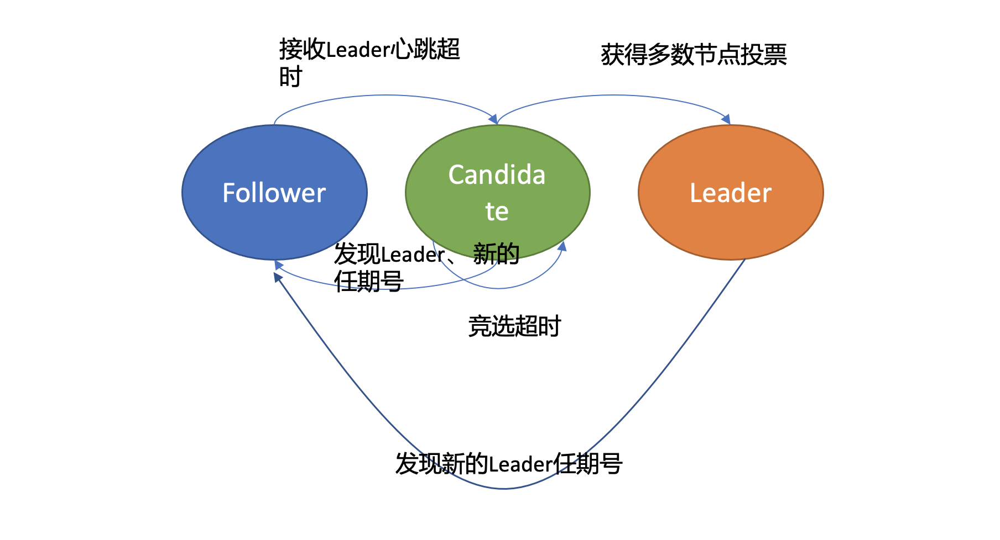

# etcd in action

---

# ch01 etcd的前世今生

他们希望在重启任意一节点的时候，用户的服务不会因此而宕机，导致无法提供服务，因此需要运行多个副本。但是多个副本之间如何协调，如何避免变更的时候所有副本不可用呢？

CoreOS 团队需要一个协调服务来存储服务配置信息、提供分布式锁

- 可用性角度：高可用。协调服务作为集群的控制面存储，它保存了各个服务的部署、运行信息。

- 数据一致性角度：提供读取“最新”数据的机制。既然协调服务必须具备高可用的目标，就必然不能存在单点故障（single point of failure），而多节点又引入了新的问题，即多个节点之间的数据一致性如何保障？

- 容量角度：低容量、仅存储关键元数据配置。协调服务保存的仅仅是服务、节点的配置信息（属于控制面配置），存储上不需要考虑数据分片。

- 功能：增删改查，监听数据变化的机制。协调服务保存了服务的状态信息，若服务有变更或异常，能快速推送变更事件给控制端。

- 运维复杂度：可维护性。在分布式系统中往往会遇到硬件 Bug、软件 Bug、人为操作错误导致节点宕机，以及新增、替换节点等运维场景，都需要对协调服务成员进行变更。若能提供 API 实现平滑地变更成员节点信息，就可以大大降低运维复杂度，减少运维成本，同时可避免因人工变更不规范可能导致的服务异常。

## etcd v1 和 v2 诞生

### etcd v1

共识算法：Raft

数据模型（Data Model）：基于目录的层次模式

API：REST API，提供了常用的 Get/Set/Delete/Watch 等 API，实现对 key-value 数据的查询、更新、删除、监听等操作。

存储引擎：简单内存树，含节点路径、值、孩子节点信息。这是一个典型的低容量设计，数据全放在内存，无需考虑数据分片，只能保存 key 的最新版本，简单易实现。

可维护性：Raft 算法提供了成员变更算法，可基于此实现成员在线、安全变更，同时此协调服务使用 Go 语言编写，无依赖，部署简单。

### etcd v2

v1版本实现了简单的 HTTP Get/Set/Delete/Watch API，但读数据一致性无法保证。v2 版本，支持通过指定 consistent 模式，从 Leader 读取数据，并将 Test And Set 机制修正为 CAS(Compare And Swap)，解决原子更新的问题。

## 为什么 Kubernetes 使用 etcd?

etcd 高可用、Watch 机制、CAS、TTL 等特性正是 Kubernetes 所需要的

当你使用 Kubernetes 声明式 API 部署服务的时候，Kubernetes 的控制器通过 etcd Watch 机制，会实时监听资源变化事件，对比实际状态与期望状态是否一致，并采取协调动作使其一致。Kubernetes 更新数据的时候，通过 CAS 机制保证并发场景下的原子更新，并通过对 key 设置 TTL 来存储 Event 事件，提升 Kubernetes 集群的可观测性，基于 TTL 特性，Event 事件 key 到期后可自动删除。

## etcd v3 诞生

### etcd v2的问题

- 功能问题
  
  - 不支持范围查询和分页查询，容易产生expensive request，进而导致严重的性能乃至雪崩问题。
  
  - 无法在一个事务中同时更新多个key。

- Watch 机制可靠性问题
  
  etcd v2 是内存型、不支持保存 key 历史版本的数据库，只在内存中使用滑动窗口保存了最近的 1000 条变更事件，当 etcd server 写请求较多、网络波动时等场景，很容易出现事件丢失问题。

- 性能瓶颈问题
  
  - HTTP/1.x
    
    - HTTP/1.x 协议没有压缩机制，拉取大量数据会导致出现 CPU 高负载、OOM、丢包等问题。
    
    - HTTP/1.x 不支持多路复用，etcd v2 client 会通过 HTTP 长连接轮询 Watch 事件，当 watcher 较多的时候，会创建大量的连接，消耗 server 端过多的 socket 和内存资源。
  
  - TTL
    
    不支持key的批量续期，如果大量key 拥有相同的 TTL，也需要分别为每个 key 发起续期操作，这会显著增加集群负载、导致集群性能显著下降。
  
  - 内存开销
    
    etcd v2 在内存维护了一颗树来保存所有节点 key 及 value，在数据量场景略大的场景会导致较大的内存开销，同时需要定时把全量内存树持久化到磁盘。这会消耗大量的 CPU 和磁盘 I/O 资源，对系统的稳定性造成一定影响。

### etcd v3的改进

在内存开销、Watch 事件可靠性、功能局限上

- 引入 B-tree、boltdb 实现一个 MVCC 数据库，数据模型从层次型目录结构改成扁平的 key-value，提供稳定可靠的事件通知，实现了事务，支持多 key 原子更新，

- 基于 boltdb 的持久化存储，显著降低了 etcd 的内存占用、避免了 etcd v2 定期生成快照时的昂贵的资源开销。

性能上

- 使用了 gRPC API，使用 protobuf 定义消息，消息编解码性能相比 JSON 超过 2 倍以上，并通过 HTTP/2.0 多路复用机制，减少了大量 watcher 等场景下的连接数。

- 使用 Lease 优化 TTL 机制，每个 Lease 具有一个 TTL，相同的 TTL 的 key 关联一个 Lease，Lease 过期的时候自动删除相关联的所有 key，不再需要为每个 key 单独续期。

- 支持范围、分页查询，可避免大包等 expensive request。

---

# ch02 基础架构：etcd一个读请求是如何执行的？

## 基础架构


etcd 可分为 Client 层、API 网络层、Raft 算法层、逻辑层和存储层。

这些层的功能如下：

- Client 层
  
  Client 层包括 client v2 和 v3 两个大版本 API 客户端库，提供了简洁易用的 API，同时支持负载均衡、节点间故障自动转移，可极大降低业务使用 etcd 复杂度，提升开发效率、服务可用性。

- API 网络层
  
  API 网络层主要包括 client 访问 server 和 server 节点之间的通信协议。一方面，client 访问 etcd server 的 API 分为 v2 和 v3 两个大版本。v2 API 使用 HTTP/1.x 协议，v3 API 使用 gRPC 协议。同时 v3 通过 etcd grpc-gateway 组件也支持 HTTP/1.x 协议，便于各种语言的服务调用。另一方面，server 之间通信协议，是指节点间通过 Raft 算法实现数据复制和 Leader 选举等功能时使用的 HTTP 协议。

- Raft 算法层
  
  Raft 算法层实现了 Leader 选举、日志复制、ReadIndex 等核心算法特性，用于保障 etcd 多个节点间的数据一致性、提升服务可用性等，是 etcd 的基石和亮点。

- 功能逻辑层
  
  etcd 核心特性实现层，如典型的 KVServer 模块、MVCC 模块、Auth 鉴权模块、Lease 租约模块、Compactor 压缩模块等，其中 MVCC 模块主要由 treeIndex 模块和 boltdb 模块组成。

- 存储层
  
  存储层包含预写日志 (WAL) 模块、快照 (Snapshot) 模块、boltdb 模块。其中 WAL 可保障 etcd crash 后数据不丢失，boltdb 则保存了集群元数据和用户写入的数据。

etcd 默认读模式（线性读）的执行流程


### client

1. etcdctl 对命令中的参数进行解析

2. 根据请求参数后会创建一个 clientv3 库对象，使用 KVServer 模块的 API 来访问 etcd server。

3. 针对每一个请求，Round-robin 算法通过轮询的方式依次从 endpoint 列表中选择一个 endpoint 访问 (长连接)，使 etcd server 负载尽量均衡。

4. 选择好 etcd server 节点，client 就可调用KVServer 模块的 Range RPC 方法，把请求发送给 etcd server。

> client 和 server 之间的通信，使用的是基于 HTTP/2 的 gRPC 协议。相比 etcd v2 的 HTTP/1.x，HTTP/2 是基于二进制而不是文本、支持多路复用而不再有序且阻塞、支持数据压缩以减少包大小、支持 server push 等特性。因此，基于 HTTP/2 的 gRPC 协议具有低延迟、高性能的特点，有效解决了我们在上一讲中提到的 etcd v2 中 HTTP/1.x 性能问题。

### KVServer

etcd 提供了丰富的 metrics、日志、请求行为检查等机制，可记录所有请求的执行耗时及错误码、来源 IP 等，也可控制请求是否允许通过，比如 etcd Learner 节点只允许指定接口和参数的访问，帮助大家定位问题、提高服务可观测性等，而这些特性是怎么非侵入式的实现呢？答案就是拦截器。

拦截器提供了在执行一个请求前后的 hook 能力，除了我们上面提到的 debug 日志、metrics 统计、对 etcd Learner 节点请求接口和参数限制等能力，etcd 还基于它实现了以下特性:

### 串行读与线性读

基本的写流程如下，当 client 发起一个更新 hello 为 world 请求后，若 Leader 收到写请求，它会将此请求持久化到 WAL 日志，并广播给各个节点，若一半以上节点持久化成功，则该请求对应的日志条目被标识为已提交，etcdserver 模块异步从 Raft 模块获取已提交的日志条目，应用到状态机 (boltdb 等)。

在多节点 etcd 集群中，各个节点的状态机数据一致性存在差异

- 对数据敏感度较低的场景
  
  如果业务场景对实对数据时效性要求并不高，读请求可直接从节点的状态机获取数据。即便数据落后一点，也不影响业务。
  
  这种直接读状态机数据返回、无需通过 Raft 协议与集群进行交互的模式，在 etcd 里叫做串行读，它具有低延时、高吞吐量的特点，适合对数据一致性要求不高的场景。

- 对数据敏感性高的场景
  
  如果业务场景对数据实时性要求高，必须读取到最新的数据，可以通过线性读来满足。
  
  线性读是指，一旦一个值更新成功，随后任何通过线性读的 client 都能及时访问到。虽然集群中有多个节点，但 client 通过线性读就如访问一个节点一样。etcd 默认读模式是线性读，因为它需要经过 Raft 协议模块，反应的是集群共识，因此在延时和吞吐量上相比串行读略差一点，适用于对数据一致性要求高的场景。

### ReadIndex

线性读的实现机制

1. follower收到一个线性读请求并转发给ReadIndex

2. ReadIndex从 Leader 获取集群最新的已提交的日志索引 (committed index)

3. Leader 向 Follower 节点发送心跳确认，一半以上节点确认 Leader 身份后才能将已提交的索引 (committed index) 返回给接受请求的节点

4. C 节点则会等待，直到状态机已应用索引 (applied index) 大于等于 Leader 的已提交索引时 (committed Index)， 通知KVServer，数据已赶上 Leader

5. 去状态机中访问数据并返回

### MVCC

多版本并发控制 (Multiversion concurrency control) 模块是为了解决 etcd v2 不支持保存 key 的历史版本、不支持多 key 事务等问题而产生的。

由内存树形索引模块 (treeIndex) 和嵌入式的 KV 持久化存储库 boltdb 组成。

boltdb是基于 B+ tree 实现的 key-value 键值库，支持事务，提供 Get/Put 等简易 API 给 etcd 操作。

- boltdb
  
  key是全局递增的版本号(revision)，value 是用户 key、value 等字段组合成的结构体

- treeIndex
  
  key是用户 key，value是版本号

对一个读事务而言

1. 获取key的版本号(revision)

2. 根据版本号在buffer查询，命中则返回

3. 未命中则从boltdb查询value

treeIndex 与 boltdb 关系如下面的读事务流程图


### treeIndex

treeIndex基于B-tree 数据结构保存用户 key 与版本号之间的映射关系

treeIndex 模块只会保存用户的 key 和相关版本号信息，用户 key 的 value 数据存储在 boltdb 里面，而它需要从 treeIndex 模块中获取 hello 这个 key 对应的版本号信息。

treeIndex 模块基于 B-tree 快速查找此 key，返回此 key 对应的索引项 keyIndex 即可。索引项中包含版本号等信息。

### buffer

etcd 出于数据一致性、性能等考虑，在访问 boltdb 前，首先会从一个内存读事务 buffer 中，二分查找你要访问 key 是否在 buffer 里面，若命中则直接返回。

### boltdb

若 buffer 未命中，此时就真正需要向 boltdb 模块查询数据。

boltdb 是如何隔离集群元数据与用户数据的呢？

答案是 bucket。boltdb 里每个 bucket 类似对应 MySQL 一个表，用户的 key 数据存放的 bucket 名字的是 key，etcd MVCC 元数据存放的 bucket 是 meta。

因 boltdb 使用 B+ tree 来组织用户的 key-value 数据，获取 bucket key 对象后，通过 boltdb 的游标 Cursor 可快速在 B+ tree 找到 key 对应的 value 数据，返回给 client。

---

# ch03 基础架构：etcd一个写请求是如何执行的？

## 整体架构


首先 client 端通过负载均衡算法选择一个 etcd 节点，发起 gRPC 调用。

然后 etcd 节点收到请求后经过 gRPC 拦截器、Quota 模块后，进入 KVServer 模块，KVServer 模块向 Raft 模块提交一个提案，提案内容为“大家好，请使用 put 方法执行一个 key 为 hello，value 为 world 的命令”。

随后此提案通过 RaftHTTP 网络模块转发、经过集群多数节点持久化后，状态会变成已提交，etcdserver 从 Raft 模块获取已提交的日志条目，传递给 Apply 模块，Apply 模块通过 MVCC 模块执行提案内容，更新状态机。

与读流程不一样的是写流程还涉及 Quota、WAL、Apply 三个模块。crash-safe 及幂等性也正是基于 WAL 和 Apply 流程的 consistent index 等实现的。

## Quota 模块

Quota模块常见错误`etcdserver: mvcc: database space exceeded`

这个错误是指当前 etcd db 文件大小超过了配额，当出现此错误后，你的整个集群将不可写入，只读，对业务的影响非常大。

导致这个错误的原因一般有两种

- etcd db默认配额为2G，当数据规模增大，db大小有可能超过2G

- etcd v3 是个 MVCC 数据库，保存了 key 的历史版本，当你未配置压缩策略的时候，随着数据不断写入，db 大小会不断增大，导致超限。

### Quota处理流程

当 etcd server 收到 put/txn 等写请求的时候，会执行以下处理

- 配额检查
  
  检查下当前 etcd db 大小加上请求的 key-value 大小之和是否超过了配额（quota-backend-bytes）

- 生成告警
  
  如果超过了配额，它会产生一个告警（Alarm）请求，告警类型是 NO SPACE，并通过 Raft 日志同步给其它节点，告知 db 空间不足，并将告警持久化存储到 db 中。

最终，无论是 API 层 gRPC 模块还是负责将 Raft 侧已提交的日志条目应用到状态机的 Apply 模块，都拒绝写入，集群只读。

如何处理错误错误处理

1. 增加配额大小（社区建议不超过8G）

2. 清除`NO SPACE`告警（etcdctl alarm disarm）

3. 检查etcd的压缩配置状态

> 在 etcd 里面，压缩模块负责回收旧版本的工作。压缩模块支持按多种方式回收旧版本，比如保留最近一段时间内的历史版本。
> 
> 压缩仅仅是将旧版本占用的空间打个空闲（Free）标记，后续新的数据写入的时候可复用这块空间，而无需申请新的空间。
> 
> 如果需要回收空间，减少 db 大小，需要使用碎片整理（defrag）， 它会遍历旧的 db 文件数据，写入到一个新的 db 文件。但是它对服务性能有较大影响，不建议在生产集群频繁使用。

配额（quota-backend-bytes）的行为

默认'0'就是使用 etcd 默认的 2GB 大小，需要根据业务场景适当调优。如果配置为小于 0 的数，就会禁用配额功能，这可能会让 db 大小处于失控，导致性能下降，不建议禁用配额。

## KVServer 模块

### Preflight Check


为了保证集群稳定性，避免雪崩，任何提交到 Raft 模块的请求，都会做一些简单的限速判断

- 限速
  
  如果 Raft 模块已提交的日志索引（committed index）比已应用到状态机的日志索引（applied index）超过了 5000，那么它就返回一个"etcdserver: too many requests"错误给 client。

- 鉴权
  
  获取请求中的鉴权信息，若使用了密码鉴权、请求中携带了 token，如果 token 无效，则返回"auth: invalid auth token"错误给 client。

- 大包检查
  
  检查写入的包大小是否超过默认的 1.5MB， 如果超过了会返回"etcdserver: request is too large"错误给给 client。

### Propose

通过Preflight Check后，会生成一个唯一的 ID，将此请求关联到一个对应的消息通知 channel，然后向 Raft 模块发起（Propose）一个提案（Proposal），提案内容为“使用 put 方法执行一个 key 为 hello，value 为 world 的命令”。

向 Raft 模块发起提案后，KVServer 模块会等待此 put 请求，等待写入结果通过消息通知 channel 返回或者超时。etcd 默认超时时间是 7 秒（5 秒磁盘 IO 延时 +2*1 秒竞选超时时间），如果一个请求超时未返回结果，则可能会出现你熟悉的 etcdserver: request timed out 错误。

## WAL 模块

Raft 模块收到提案后，如果当前节点是 Follower，它会转发给 Leader，只有 Leader 才能处理写请求。

Leader 收到提案后，通过 Raft 模块输出待转发给 Follower 节点的消息和待持久化的日志条目，日志条目则封装了 put hello 提案内容。

etcdserver 从 Raft 模块获取到以上消息和日志条目后，作为 Leader，它会将 put 提案消息广播给集群各个节点，同时需要把集群 Leader 任期号、投票信息、已提交索引、提案内容持久化到一个 WAL（Write Ahead Log）日志文件中，用于保证集群的一致性、可恢复性。

### WAL日志结构


WAL日志记录由如下的部分组成

- Len Field（数据长度）

- Type（记录类型）
  
  - 文件元数据记录，包含节点 ID、集群 ID 信息，它在 WAL 文件创建的时候写入
  
  - 日志条目记录，包含 Raft 日志信息，如 put 提案内容
  
  - 状态信息记录，包含集群的任期号、节点投票信息等，一个日志文件中会有多条，以最后的记录为准
  
  - CRC 记录，包含上一个 WAL 文件的最后的 CRC（循环冗余校验码）信息， 在创建、切割 WAL 文件时，作为第一条记录写入到新的 WAL 文件， 用于校验数据文件的完整性、准确性等
  
  - 快照记录包含快照的任期号、日志索引信息，用于检查快照文件的准确性

- Crc（校验码）

- Data（记录内容）

WAL 模块又是如何持久化一个 put 提案的日志条目类型记录呢?

Raft日志条目的数据结构

- Term 是 Leader 任期号，随着 Leader 选举增加

- Index 是日志条目的索引，单调递增增加

- Type 是日志类型，比如是普通的命令日志（EntryNormal）还是集群配置变更日志（EntryConfChange）

- Data 保存我们上面描述的 put 提案内容。

了解完 Raft 日志条目数据结构后，我们再看 WAL 模块如何持久化 Raft 日志条目。

1. 将 Raft 日志条目内容（含任期号、索引、提案内容）序列化后保存到 WAL 记录的 Data 字段

2. 计算 Data 的 CRC 值

3. 设置 Type 为 Entry Type

4. 计算 WAL 记录的长度

5. 调用 fsync 持久化到磁盘，将日志条目保存到持久化存储中

执行提案内容

当一半以上节点持久化此日志条目后， Raft 模块就会通过 channel 告知 etcdserver 模块，put 提案已经被集群多数节点确认，提案状态为已提交，可以执行此提案内容了。

etcdserver 模块从 channel 取出提案内容，添加到先进先出（FIFO）调度队列，随后通过 Apply 模块按入队顺序，异步、依次执行提案内容。

## Apply 模块


如果 put 请求提案在执行提案的时候 etcd 突然 crash 了， 重启恢复的时候，etcd 是如何找回异常提案，再次执行的呢？

因为提交给 Apply 模块执行的提案已获得多数节点确认、持久化，所以在etcd 重启时，会从 WAL 中解析出 Raft 日志条目内容，追加到 Raft 日志的存储中，并重放已提交的日志提案给 Apply 模块执行。

如何确保幂等性，防止提案重复执行导致数据混乱呢?

- 日志条目索引是全局单调递增的

- 在boltdb中存储当前已经执行过的日志条目索引（consistent index）

以上两个操作需要作为原子事务提交，保证幂等性。

Apply 模块在执行提案内容前，首先会判断当前提案是否已经执行过了，如果执行了则直接返回，若未执行同时无 db 配额满告警，则进入到 MVCC 模块，开始持久化存储。

## MVCC

### treeIndex


版本号（revision）在 etcd 里面发挥着重大作用，它是 etcd 的逻辑时钟。etcd 启动的时候默认版本号是 1，随着你对 key 的增、删、改操作而全局单调递增。

1. 获取最大版本号currentRevision
   
   在etcd启动的时候，从最小值 1 开始枚举到最大值，未读到数据的时候则结束，最后读出来的版本号即是当前 etcd 的最大版本号 currentRevision。

2. 基于最大版本号生成新的revision

3. 查询 key 的创建版本号、修改次数信息，将这些信息将填充到 boltdb 的 value 中，同时将用户的 key 和 revision 等信息存储到 B-tree

### boltdb

treeIndex生成的 revision就是 boltdb 的 key，通过它就可以往 boltdb 写数据了。

- 通过提供桶（bucket）机制实现类似 MySQL 表的逻辑隔离，每一个用户的key就是一个名为key的桶，这个桶在启动 etcd 的时候会自动创建。

- etcd 本身及其它功能需要持久化存储的话，都会创建对应的桶。比如上面的 consistent index 实际上就存储在元数据（meta）桶里面。

- value包含以下内容
  
  - 用户key的名称
  
  - key 创建时的版本号（create_revision）、最后一次修改时的版本号（mod_revision）、key 自身修改的次数（version）
  
  - 用户key的value值
  
  - 租约信息

boltdb value 的值就是将含以上信息的结构体序列化成的二进制数据，然后通过 boltdb 提供的 put 接口，etcd 就将数据写入 boltdb。

put调用成功并不代表数据已经持久化到db文件，etcd 并未提交事务（commit），因此数据只更新在 boltdb 所管理的内存数据结构中。

事务提交的过程，包含 B+tree 的平衡、分裂，将 boltdb 的脏数据（dirty page）、元数据信息刷新到磁盘，因此事务提交的开销是昂贵的。如果每次更新都提交事务，etcd 写性能就会较差。

解决方案

- 调整 boltdb 的 bucket.FillPercent 参数，使每个 page 填充更多数据，减少 page 的分裂次数并降低 db 空间。

- 合并多个写事务请求，通常情况下，异步机制定时（默认每隔 100ms）将批量事务一次性提交（pending 事务过多才会触发同步提交）， 从而大大提高吞吐量。

因为事务是异步提交的，如果读请求时事务还没有提交，可能无法从 boltdb 获取到最新数据。

为了解决这个问题，etcd 引入了一个 bucket buffer 来保存暂未提交的事务数据。在更新 boltdb 的时候，etcd 也会同步数据到 bucket buffer。

因此 etcd 处理读请求的时候会优先从 bucket buffer 里面读取，其次再从 boltdb 读，通过 bucket buffer 实现读写性能提升，同时保证数据一致性。

> WAL日志是用来持久化raft日志条目和相关集群元数据信息的，可防止节点发生重启、crash后，对应的已提交日志条目丢失等异常情况，一般情况下，它是将数据持久化到磁盘中。
> Raft日志记录了节点过去一段时间内收到的写请求，如put/del/txn操作等，一般是通过一个内存数组来存储最近一系列日志条目。当Follower节点落后Leader较小时，就可以通过Leader内存中维护的日志条目信息, 将落后的日志条目发送给它，最终各个节点应用一样的日志条目内容，来确保各个节点数据一致性。
> etcd节点重启后，可通过WAL日志来重建部分raft日志条目。

[Raft 分布式共识算法动画演示 (kailing.pub)](http://kailing.pub/raft/index.html)

---

# ch04 Raft协议：etcd如何实现高可用、数据强一致的？

## 如何避免单点故障

单节点往往存在单点故障问题，一宕机就整个服务不可用，对业务影响非常大。

数据复制技术，实现多副本。通过数据复制方案，一方面我们可以提高服务可用性，避免单点故障。另一方面，多副本可以提升读吞吐量、甚至就近部署在业务所在的地理位置，降低访问延迟。

### 多副本复制是如何实现的呢？

主从复制

- 全同步复制是指主收到一个写请求后，必须等待全部从节点确认返回后，才能返回给客户端成功。这种方案为了保证数据一致性，但牺牲了可用性。

- 异步复制是指主收到一个写请求后，可及时返回给 client，异步将请求转发给各个副本，可能导致数据丢失，但是可用性最高。

- 半同步复制介于全同步复制、异步复制之间，它是指主收到一个写请求后，至少有一个副本接收数据后，就可以返回给客户端成功，在数据一致性、可用性上实现了平衡和取舍。

去中心化复制

它是指在一个 n 副本节点集群中，任意节点都可接受写请求，但一个成功的写入需要 w 个节点确认，读取也必须查询至少 r 个节点。

可以根据实际业务场景对数据一致性的敏感度，设置合适 w/r 参数。比如希望每次写入后，任意 client 都能读取到新值，如果 n 是 3 个副本，你可以将 w 和 r 设置为 2，这样读两个节点时候，必有一个节点含有最近写入的新值，这称之为法定票数读（quorum read）。

为了解决单点故障，从而引入了多副本。但基于复制算法实现的数据库，为了保证服务可用性，大多数提供的是最终一致性，总而言之，不管是主从复制还是异步复制，都存在一定的缺陷。

### 如何解决以上复制算法的困境呢？

共识算法

基于复制状态机，复制状态机由共识模块、日志模块、状态机组成。通过共识模块保证各个节点日志的一致性，然后各个节点基于同样的日志、顺序执行指令，最终各个复制状态机的结果实现一致。


Raft算法将共识问题拆分为三个子问题

- Leader 选举，Leader 故障后集群能快速选出新 Leader。

- 日志复制， 集群只有 Leader 能写入日志， Leader 负责复制日志到 Follower 节点，并强制 Follower 节点与自己保持相同。

- 安全性，一个任期内集群只能产生一个 Leader、已提交的日志条目在发生 Leader 选举时，一定会存在更高任期的新 Leader 日志中、各个节点的状态机应用的任意位置的日志条目内容应一样等。

## Leader 选举

Raft协议中的节点状态

- Follower，跟随者， 同步从 Leader 收到的日志，etcd 启动的时候默认为此状态。

- Candidate，竞选者，可以发起 Leader 选举。

- Leader，集群领导者， 唯一性，拥有同步日志的特权，需定时广播心跳给 Follower 节点，以维持领导者身份。



正常情况下，Leader 节点会按照心跳间隔时间，定时广播心跳消息（MsgHeartbeat 消息）给 Follower 节点，以维持 Leader 身份。 Follower 收到后回复心跳应答包消息（MsgHeartbeatResp 消息）给 Leader

当 Leader 节点异常后，Follower 节点接收 Leader 节点心跳消息就会超时，当超时时间大于竞选超时时间时，它会转变成 Candidate 节点，并可发起竞选 Leader 投票，若获得集群多数节点的支持后，它就可转变成 Leader 节点。

1. Leader 节点异常

2. Follower 节点接收 Leader 节点心跳消息超时，当超时时间大于竞选超时时间时，转变成 Candidate 节点

3. Candidate 节点发起选举流程，自增任期号，投票给自己，并向其他节点发送竞选 Leader 投票消息（MsgVote）

4. 其他Follower节点收到投票信息后，对数据和任期进行判断，如果Candidate节点的数据至少和自己一样新、任期号大于自己当前任期号、并且未投票给其他候选者，就可以给Candidate投票

5. 当Candidate获得了集群半数以上节点的支持，就成为了新的leader

为了避免leader异常后，可能存在多个节点同时成为Candidate并发起投票，导致选举失败，这里Raft引入了随机数，使得每个节点等待发起选举的时间点不一致，从而避免同时发起投票。

当之前的异常Leader恢复后，有可能因为网络原因导致多次发起选举，自增任期，此时他的任期比当前集群的任期大，当前的Leader收到了更新的任期号，就会触发新一轮选举，影响服务的可用性。即使因为之前的Leader数据上落后于当前Leader，所以不会在新的选举中成功，但是这样的选举是无效的。


在 etcd 3.4 中，etcd 引入了一个 PreVote 参数（默认 false），可以用来启用 PreCandidate 状态解决此问题。Follower 在转换成 Candidate 状态前，先进入 PreCandidate 状态，不自增任期号， 发起预投票。若获得集群多数节点认可，确定有概率成为 Leader 才能进入 Candidate 状态，发起选举流程。

使用PreCandidate可以保证之前的Leader因为数据落后，在PreCandidate阶段就无法获取多数节点的支持，也就不会进入Candidate状态而导致集群重新选举了。

## 日志复制


1. Leader 收到 client 的请求后，etcdserver 的 KV 模块会向 Raft 模块提交一个 put hello 为 world 提案消息（MsgProp）。

2. Leader 的 Raft 模块获取到 MsgProp 提案消息后，为此提案生成一个日志条目，追加到未持久化、不稳定的 Raft 日志中，随后会遍历集群 Follower 列表和进度信息，为每个 Follower 生成追加（MsgApp）类型的 RPC 消息，此消息中包含待复制给 Follower 的日志条目。

3. etcdserver 模块通过 channel 从 Raft 模块获取到 Ready 结构后，通过基于 HTTP 协议的网络模块将追加日志条目消息（MsgApp）广播给 Follower，并同时将待持久化的日志条目持久化到 WAL 文件中，最后将日志条目追加到稳定的 Raft 日志存储中。

4. 各个 Follower 收到追加日志条目（MsgApp）消息，并通过安全检查后，它会持久化消息到 WAL 日志中，并将消息追加到 Raft 日志存储，随后会向 Leader 回复一个应答追加日志条目（MsgAppResp）的消息，告知 Leader 当前已复制的日志最大索引。

5. Leader 收到应答追加日志条目（MsgAppResp）消息后，会将 Follower 回复的已复制日志最大索引更新到跟踪 Follower 进展的 Match Index 字段。

6. Leader 根据 Follower 的 MatchIndex 信息，计算出一个位置，如果这个位置已经被一半以上节点持久化，那么这个位置之前的日志条目都可以被标记为已提交。Leader 通过在发送心跳消息（MsgHeartbeat）给 Follower 节点时，告知它已经提交的日志索引位置。

7. 其他各个节点的 etcdserver 模块，通过 channel 从 Raft 模块获取到已提交的日志条目，应用日志条目内容到存储状态机，返回结果给 client。

> 一个日志条目被确定为已提交的前提是，它需要被 Leader 同步到一半以上节点上。

Leader 是如何知道从哪个索引位置发送日志条目给 Follower，以及 Follower 已复制的日志最大索引是多少呢？

Raft日志由有序号标识的一个个条目组成，每个日志条目内容保存了 Leader 任期号和提案内容。

Leader 会维护两个核心字段来追踪各个 Follower 的进度信息

- NextIndex， 它表示 Leader 发送给 Follower 节点的下一个日志条目索引。

- MatchIndex， 它表示 Follower 节点已复制的最大日志条目的索引

日志条目什么时候才会追加到稳定的 Raft 日志中呢？Raft 模块负责持久化吗？

Raft 模块本身不负责持久化，上层应用通过 Raft 模块的输出接口，获取到待持久化的日志条目和待发送给 Peer 节点的消息后，持久化日志条目到自定义的 WAL 模块，通过自定义的网络模块将消息发送给 Peer 节点。日志条目持久化到稳定存储中后，这时候你就可以将日志条目追加到稳定的 Raft 日志中。即便这个日志是内存存储，节点重启时也不会丢失任何日志条目，因为 WAL 模块已持久化此日志条目，可通过它重建 Raft 日志。

## 安全性

Raft 通过给选举和日志复制增加一系列规则，来实现 Raft 算法的安全性。

### 选举规则

- 当节点收到选举投票的时候，需检查候选者的最后一条日志中的任期号，若小于自己则拒绝投票。

- 如果任期号相同，日志index却比自己小，也拒绝为其投票。

- 对于一个给定的任期号，最多只会有一个 leader 被选举出来，leader 的诞生需获得集群一半以上的节点支持。

- 每个节点在同一个任期内只能为一个节点投票，节点需要将投票信息持久化，防止异常重启后再投票给其他节点。

### 日志复制规则

- Leader 完全特性
  
  如果某个日志条目在某个任期号中已经被提交，那么这个条目必然出现在更大任期号的所有 Leader 中

- 只附加原则
  
  Leader 只能追加日志条目，不能删除已持久化的日志条目

- 日志匹配特性
  
  Leader 在发送追加日志 RPC 消息时，会把新的日志条目紧接着之前的条目的索引位置和任期号包含在里面。Follower 节点会检查相同索引位置的任期号是否与 Leader 一致，一致才能追加，这就是日志匹配特性。

---

# ch05 鉴权：如何保护数据安全？

## 整体架构

etcd 鉴权体系架构由控制面和数据面组成

### 控制面


通过客户端工具 etcdctl 和鉴权 API 动态调整认证、鉴权规则，AuthServer 收到请求后，为了确保各节点间鉴权元数据一致性，会通过 Raft 模块进行数据同步。当对应的 Raft 日志条目被集群半数以上节点确认后，Apply 模块通过鉴权存储 (AuthStore) 模块，执行日志条目的内容，将规则存储到 boltdb 的一系列“鉴权表”里面。

### 数据面


- 认证
  
  认证的目的是检查 client 的身份是否合法、防止匿名用户访问等。目前 etcd 实现了两种认证机制，分别是密码认证和证书认证。
  
  认证通过后，为了提高密码认证性能，会分配一个 Token给 client，client 后续其他请求携带此 Token，server 就可快速完成 client 的身份校验工作。实现分配 Token 的服务也有多种，这是 TokenProvider 所负责的，目前支持 SimpleToken 和 JWT 两种。

- 授权
  
  授权的目的是检查 client 是否有权限操作你请求的数据路径，etcd 实现了 RBAC 机制，支持为每个用户分配一个角色，为每个角色授予最小化的权限。

## 认证

### 密码认证

etcd 支持为每个用户分配一个账号名称、密码，对用户密码的计算支持以下特性：

- 高安全性hash函数

- 随机添加盐值salt

- 可自定义的hash计算次数

#### 开启密码认证

```shell
# 添加root用户
$ etcdctl user add root:root
User root created
# 开启认证
$ etcdctl auth enable
Authentication Enabled
# 添加alice用户
$ etcdctl user add alice:alice --user root:root
User alice created
```

#### 认证流程

##### 账号创建

1. 使用 bcrpt 库的 blowfish 算法，基于明文密码、随机分配的 salt、自定义的 cost、迭代多次计算得到一个 hash 值，并将加密算法版本、salt 值、cost、hash 值组成一个字符串，作为加密后的密码。

2. 将用户名 alice 作为 key，用户名、加密后的密码作为 value，存储到 boltdb 的 authUsers bucket 里面。

##### 身份验证

1. 鉴权模块首先会根据你请求的用户名 alice，从 boltdb 获取加密后的密码， hash 值包含了算法版本、salt、cost 等信息。

2. 根据请求中的明文密码，计算出最终的 hash 值，若计算结果与存储一致，那么身份校验通过

如何提升密码认证性能？

etcd server 验证用户密码成功后，它就会返回一个 Token 字符串给 client，用于表示用户的身份。后续请求携带此 Token，就无需再次进行密码校验，实现了通信证的效果。etcd 目前支持两种 Token，分别为 Simple Token 和 JWT Token。

### Simple Token

Simple Token 的核心原理是当一个用户身份验证通过后，生成一个随机的字符串值 Token 返回给 client，并在内存中使用 map 存储用户和 Token 映射关系。当收到用户的请求时， etcd 会从请求中获取 Token 值，转换成对应的用户名信息，返回给下层模块使用。

etcd 生成的每个 Token，都有一个过期时间 TTL 属性，Token 过期后 client 需再次验证身份，因此可显著缩小数据泄露的时间窗口，在性能上、安全性上实现平衡。

#### Simple Token的缺陷

它是是有状态的，etcd server 需要使用内存存储 Token 和用户名的映射关系。

它的可描述性很弱，client 无法通过 Token 获取到过期时间、用户名、签发者等信息。

### JWT Token

JWT 是 Json Web Token 缩写， 它是一个基于 JSON 的开放标准（RFC 7519）定义的一种紧凑、独立的格式，可用于在身份提供者和服务提供者间，传递被认证的用户身份信息。它由 Header、Payload、Signature 三个对象组成， 每个对象都是一个 JSON 结构体。

1. Header，它包含 alg 和 typ 两个字段，alg 表示签名的算法，etcd 支持 RSA、ESA、PS 系列，typ 表示类型就是 JWT。

2. Payload，它表示载荷，包含用户名、过期时间等信息，可以自定义添加字段。

3. Signature，首先它将 header、payload 使用 base64 url 编码，然后将编码后的字符串用"."连接在一起，最后用我们选择的签名算法比如 RSA 系列的私钥对其计算签名，输出结果即是 Signature。

JWT Token是无状态的，自带用户名、版本号、过期时间等描述信息，etcd server 不需要保存它，client 可方便、高效地获取到 Token 的过期时间、用户名等信息。

它解决了 Simple Token 的若干不足之处，安全性更高，etcd 社区建议大家在生产环境若使用了密码认证，应使用 JWT  Token( --auth-token 'jwt')，而不是默认的 Simple Token。

### 证书认证

一个 x509 client 证书的内容，它含有证书版本、序列号、签名算法、签发者、有效期、主体名等信息，我们重点要关注的是主体名中的 CN 字段。

在 etcd 中，如果你使用了 HTTPS 协议并启用了 client 证书认证 (--client-cert-auth)，它会取 CN 字段作为用户名。

证书认证在稳定性、性能上都优于密码认证。

稳定性上，它不存在 Token 过期、使用更加方便、会让你少踩坑，避免了不少 Token 失效而触发的 Bug。

性能上，证书认证无需像密码认证一样调用昂贵的密码认证操作 。

## 授权

开启鉴权后，put 请求命令在应用到状态机前，etcd 还会对发出此请求的用户进行权限检查， 判断其是否有权限操作请求的数据。

常用的权限控制方法有 ACL(Access Control List)、ABAC(Attribute-based access control)、RBAC(Role-based access control)，etcd 实现的是 RBAC 机制。

### RBAC


- User表示用户

- Role表示角色，它是权限的赋予对象。

- Permission表示具体权限明细，赋予某个role拥有什么权限，目前支持三种权限，分别是 READ、WRITE、READWRITE。

配置授权

```shell
# 创建一个admin role 
$ etcdctl role add admin  --user root:root
Role admin created
# 分配一个可读写[hello，helly]范围数据的权限给admin role 
$ etcdctl role grant-permission admin readwrite hello helly --user root:root
Role admin updated
# 将用户alice和admin role关联起来，赋予admin权限给user
$ etcdctl user grant-role alice admin --user root:root
Role admin is granted to user alice
```

---

# ch06 租约：如何检测你的客户端存活？

## 什么是 Lease

单副本部署的组件，是无法保证其高可用性的。

多副本部署引入 Leader 选举机制，保证同一时刻只有一个能对外提供服务。

Leader 选举的本质

- 保证 Leader 的唯一性，确保集群不出现多个 Leader，才能保证业务逻辑准确性，也就是安全性（Safety）、互斥性。

- 主节点故障后，备节点应可快速感知到其异常，也就是活性（liveness）检测。实现活性检测主要有两种方案。
  
  - 被动型检测
    
    通过探测节点定时拨测 Leader 节点，看是否健康，比如 Redis Sentinel。
  
  - 主动型上报
    
    Leader 节点可定期向协调服务发送"特殊心跳"汇报健康状态，若其未正常发送心跳，并超过和协调服务约定的最大存活时间后，就会被协调服务移除 Leader 身份标识。同时其他节点可通过协调服务，快速感知到 Leader 故障了，进而发起新的选举。

etcd中的Lease，正是基于主动型上报模式，提供的一种活性检测机制。

Lease 指client 和 etcd server 之间存在一个约定，内容是 etcd server 保证在约定的有效期内（TTL），不会删除你关联到此 Lease 上的 key-value。若你未在有效期内续租，那么 etcd server 就会删除 Lease 和其关联的 key-value。

## Lease 整体架构


etcd 在启动的时候，创建 Lessor 模块的时候，它会启动两个常驻 goroutine

- RevokeExpiredLease 任务，定时检查是否有过期 Lease，发起撤销过期的 Lease 操作。

- CheckpointScheduledLease，定时触发更新 Lease 的剩余到期时间的操作。

Lessor 模块提供了 Grant、Revoke、LeaseTimeToLive、LeaseKeepAlive API 给 client 使用，各接口作用如下:

- Grant 表示创建一个 TTL 为你指定秒数的 Lease，Lessor 会将 Lease 信息持久化存储在 boltdb 中

- Revoke 表示撤销 Lease 并删除其关联的数据

- LeaseTimeToLive 表示获取一个 Lease 的有效期、剩余时间

- LeaseKeepAlive 表示为 Lease 续期。

```shell
# 创建一个TTL为600秒的lease，etcd server返回LeaseID
$ etcdctl lease grant 600
lease 326975935f48f814 granted with TTL(600s)

# 查看lease的TTL、剩余时间
$ etcdctl lease timetolive 326975935f48f814
lease 326975935f48f814 granted with TTL(600s)， remaining(590s)
```

lease的创建流程

- 通过 Raft 模块完成日志同步，

- Apply 模块通过 Lessor 模块的 Grant 接口执行日志条目内容。
  
  - Lessor 的 Grant 接口会把 Lease 保存到内存的 ItemMap 数据结构中
  
  - 持久化 Lease，将 Lease 数据保存到 boltdb 的 Lease bucket 中，返回一个唯一的 LeaseID 给 client

关联lease

```shell
$ etcdctl put node healthy --lease 326975935f48f818
OK
$ etcdctl get node -w=json | python -m json.tool
{
    "kvs":[
        {
            "create_revision":24，
            "key":"bm9kZQ=="，
            "Lease":3632563850270275608，
            "mod_revision":24，
            "value":"aGVhbHRoeQ=="，
            "version":1
        }
    ]
}
```

当你通过 put 等命令新增一个指定了"--lease"的 key 时，MVCC 模块它会通过 Lessor 模块的 Attach 方法，将 key 关联到 Lease 的 key 内存集合 ItemSet 中。


一个 Lease 关联的 key 集合是保存在内存中的，那么 etcd 重启时，是如何知道每个 Lease 上关联了哪些 key 呢?

etcd 的 MVCC 模块在持久化存储 key-value 的时候，保存到 boltdb 的 value 是个结构体（mvccpb.KeyValue）， 不仅包含你的 key-value 数据，还包含了关联的 LeaseID 等信息。因此当 etcd 重启时，可根据此信息，重建关联各个 Lease 的 key 集合列表。

## 如何优化 Lease 续期性能

### 性能问题

- TTL 过长会导致节点异常后，无法及时从 etcd 中删除，影响服务可用性，而过短，则要求 client 频繁发送续期请求。

- Lease 数量，如果 Lease 成千上万个，那么 etcd 可能无法支撑如此大规模的 Lease 数，导致高负载。

### 解决方案

v2

没有 Lease 概念，TTL 属性是在 key 上面，为了保证 key 不删除，即便 TTL 相同，client 也需要为每个 TTL、key 创建一个 HTTP/1.x 连接，定时发送续期请求给 etcd server。

v3

将TTL 属性转移到了 Lease 上， 同时协议从 HTTP/1.x 优化成 gRPC 协议。

- 当不同 key 但 TTL 相同，可复用同一个 Lease， 显著减少了 Lease 数。

- 通过 gRPC HTTP/2 实现了多路复用，流式传输，同一连接可支持为多个 Lease 续期，大大减少了连接数。

## 如何高效淘汰过期 Lease

1. Leader 节点按过期时间顺序维护了一个最小堆

2. 获取过期的 LeaseID，Lessor 主循环每隔 500ms 执行一次撤销 Lease 检查（RevokeExpiredLease），每次轮询堆顶的元素，若已过期则加入到待淘汰列表，直到堆顶的 Lease 过期时间大于当前，则结束本轮轮询。
   
   将已确认过期的 LeaseID，保存在一个名为 expiredC 的 channel 中。

3. Leader获取到 ID 后， 发起 revoke 操作，通过 Raft Log 传递给 Follower 节点

4. 各个节点收到 revoke Lease 请求后，获取关联到此 Lease 上的 key 列表，从 boltdb 中删除 key，从 Lessor 的 Lease map 内存中删除此 Lease 对象，最后还需要从 boltdb 的 Lease bucket 中删除这个 Lease。

### 为什么需要 checkpoint 机制

检查 Lease 是否过期、维护最小堆、针对过期的 Lease 发起 revoke 操作，都是 Leader 节点负责的，那么当 Leader 因重启、crash、磁盘 IO 等异常不可用时，Follower 节点就会发起 Leader 选举，新 Leader 要完成以上职责，必须重建 Lease 过期最小堆等管理数据结构。

当集群发生 Leader 切换后，新的 Leader 基于 Lease map 信息，按 Lease 过期时间构建一个最小堆时，但是etcd 早期版本为了优化性能，并未持久化存储 Lease 剩余 TTL 信息，因此重建的时候就会自动给所有 Lease 自动续期了。然而若较频繁出现 Leader 切换，切换时间小于 Lease 的 TTL，这会导致 Lease 永远无法删除，大量 key 堆积，db 大小超过配额等异常。

### checkpoint

- etcd 启动的时候，Leader 节点后台会运行CheckPointScheduledLeases 异步任务，定期批量地将 Lease 剩余的 TTL 基于 Raft Log 同步给 Follower 节点，Follower 节点收到 CheckPoint 请求后，更新内存数据结构 LeaseMap 的剩余 TTL 信息。

- 当 Leader 节点收到 KeepAlive 请求的时候，它也会通过 checkpoint 机制把此 Lease 的剩余 TTL 重置，并同步给 Follower 节点，尽量确保续期后集群各个节点的 Lease 剩余 TTL 一致性。

---

# ch07 MVCC：如何实现多版本并发控制？

## 什么是 MVCC

多版本技术实现的一种并发控制机制。

MVCC 机制是基于多版本技术实现的一种乐观锁机制，它乐观地认为数据不会发生冲突，但是当事务提交时，具备检测数据是否冲突的能力。在 MVCC 数据库中，更新一个 key-value 数据并不会直接覆盖原数据，而是新增一个版本来存储新的数据，每个数据都有一个版本号。

每次修改操作，版本号都会递增。每修改一次，生成一条新的数据记录。当指定版本号读取数据时，实际上访问的是版本号生成那个时间点的快照数据。

删除数据的时候，它实际也是新增一条带删除标识的数据记录。

```shell
# 更新key hello为world1
$ etcdctl put hello world1
OK
# 通过指定输出模式为json,查看key hello更新后的详细信息
$ etcdctl get hello -w=json
{
    "kvs":[
        {
            "key":"aGVsbG8=",
            "create_revision":2,
            "mod_revision":2,
            "version":1,
            "value":"d29ybGQx"
        }
    ],
    "count":1
}
# 再次修改key hello为world2
$ etcdctl put hello world2
OK
# 确认修改成功,最新值为wolrd2
$ etcdctl get hello
hello
world2
# 指定查询版本号,获得了hello上一次修改的值
$ etcdctl get hello --rev=2
hello
world1
# 删除key hello
$ etcdctl del  hello
1
# 删除后指定查询版本号3,获得了hello删除前的值
$ etcdctl get hello --rev=3
hello
world2
```

## 整体架构


MVCC 模块由 treeIndex、Backend/boltdb 组成。

MVCC 模块将请求请划分成两个类别，分别是读事务（ReadTxn）和写事务（WriteTxn）。

读事务负责处理 range 请求，写事务负责 put/delete 操作。

读写事务基于 treeIndex、Backend/boltdb 提供的能力，实现对 key-value 的增删改查功能。

- treeIndex 模块基于内存版 B-tree 实现了 key 索引管理，它保存了用户 key 与版本号（revision）的映射关系等信息。

- Backend 模块负责 etcd 的 key-value 持久化存储，主要由 ReadTx、BatchTx、Buffer 组成，ReadTx 定义了抽象的读事务接口，BatchTx 在 ReadTx 之上定义了抽象的写事务接口，Buffer 是数据缓存区。

扩展性

etcd 设计上支持多种 Backend 实现，目前实现的 Backend 是 boltdb。boltdb 是一个基于 B+ tree 实现的、支持事务的 key-value 嵌入式数据库。

整体流程

发起一个 get hello 命令时，从 treeIndex 中获取 key 的版本号，然后再通过这个版本号，从 boltdb 获取 value 信息。boltdb 的 value 是包含用户 key-value、各种版本号、lease 信息的结构体。


## treeIndex

通过 etcdctl 发起一个 put hello 操作时，etcd v2 直接更新内存树，这就导致历史版本直接被覆盖，无法支持保存 key 的历史版本。在 etcd v3 中引入 treeIndex 模块正是为了解决这个问题，支持保存 key 的历史版本，提供稳定的 Watch 机制和事务隔离等能力。

### 如何保存key的历史版本？

1. etcd 在每次修改 key 时会生成一个全局递增的版本号（revision）。

2. 通过数据结构 B-tree 保存用户 key 与版本号之间的关系。

3. 以版本号作为 boltdb key，以用户的 key-value 等信息作为 boltdb value，保存到 boltdb。

etcd 保存用户 key 与版本号映射关系的数据结构 B-tree，为什么 etcd 使用它而不使用哈希表、平衡二叉树？

- 从 etcd 的功能特性上分析， 因 etcd 支持范围查询，因此保存索引的数据结构也必须支持范围查询才行。所以哈希表不适合，而 B-tree 支持范围查询。

- 从性能上分析，平横二叉树每个节点只能容纳一个数据、导致树的高度较高，而 B-tree 每个节点可以容纳多个数据，树的高度更低，更扁平，涉及的查找次数更少，具有优越的增、删、改、查性能。

在一个度为 d 的 B-tree 中，节点保存的最大 key 数为 2d - 1，否则需要进行平衡、分裂操作。在 etcd treeIndex 模块中，创建的是最大度 32 的 B-tree，也就是一个叶子节点最多可以保存 63 个 key。

keyIndex的结构

```go
type keyIndex struct {
   key         []byte //用户的key名称
   modified    revision //最后一次修改key时的etcd版本号
   generations []generation //generation保存了一个key若干代版本号信息，每代中包含对key的多次修改的版本号列表
}
```

generations 表示一个 key 从创建到删除的过程，每代对应 key 的一个生命周期的开始与结束。

第一次创建一个 key 时，会生成第 0 代，后续的修改操作都是在往第 0 代中追加修改版本号。当你把 key 删除后，它就会生成新的第 1 代，一个 key 不断经历创建、删除的过程，它就会生成多个代。

generation的结构

```go
type generation struct {
   ver     int64    //表示此key的修改次数
   created revision //表示generation结构创建时的版本号
   revs    []revision //每次修改key时的revision追加到此数组
}
```

revision的结构

```go
type revision struct {
   main int64
   sub int64
}
```

revision 包含 main 和 sub 两个字段，main 是全局递增的版本号，它是个 etcd 逻辑时钟，随着 put/txn/delete 等事务递增。sub 是一个事务内的子版本号，从 0 开始随事务内的 put/delete 操作递增。

## 更新key原理


1. 获取key的keyIndex信息
   
   keyIndex信息包括创建版本号、修改次数
   
   - boltdb的key：根据当前的全局版本号生成此次操作对应的版本号自增
   
   - boltdb的value：由用户 key、value、create_revision、mod_revision、version、lease 组成
     
     - create_revision 表示此 key 创建时的版本号。
     
     - mod_revision 表示 key 最后一次修改时的版本号，即 put 操作发生时的全局版本号加 1；
     
     - version 表示此 key 的修改次数。

2. 写入新的key-value到boltdb和buffer
   
   填充 boltdb 的 KeyValue 结构体后，通过 Backend 的写事务 batchTx 接口将 key{2,0},value 为 mvccpb.KeyValue 保存到 boltdb 的缓存中，并同步更新 buffer

3. 创建/更新keyIndex到treeIndex
   
   - 更新modified 为最后一次修改版本号
   
   - 更新generations
     
     - ver更新为当前修改次数加一
     
     - created保存创建generation时的版本号
     
     - revisions数组保存对此key修改的版本号列表

4. 异步提交事务
   
   为了提升 etcd 的写吞吐量、性能，一般情况下（默认堆积的写事务数大于 1 万才在写事务结束时同步持久化），数据持久化由 Backend 的异步 goroutine 完成，它通过事务批量提交，定时将 boltdb 页缓存中的脏数据提交到持久化存储磁盘中

## 查询key原理


etcdctl 发起一个 get hello 操作，MVCC 模块首先会创建一个读事务对象（TxnRead），etcd Backend 实现了 ConcurrentReadTx， 也就是并发读特性。并发读特性的核心原理是创建读事务对象时，它会全量拷贝当前写事务未提交的 buffer 数据，并发的读写事务不再阻塞在一个 buffer 资源锁上，实现了全并发读。

### 一般查询流程

1. 根据 key 从 treeIndex 模块获取版本号，因我们未带版本号读，默认是读取最新的数据。treeIndex 模块从 B-tree 中，根据 key 查找到 keyIndex 对象后，匹配有效的 generation，返回 generation 的 revisions 数组中最后一个版本号给读事务对象。

2. 读事务对象根据此版本号为 key，通过 Backend 的并发读事务（ConcurrentReadTx）接口，优先从 buffer 中查询，命中则直接返回，否则从 boltdb 中查询此 key 的 value 信息。

### 指定版本号查询

指定历史版本号的读请求时，实际是读指定版本号的时间点的快照数据。treeIndex 模块会遍历 generation 内的历史版本号，返回小于等于指定版本号的最大历史版本号，以它作为 boltdb 的 key，从 boltdb 中查询出 value 即可。

## 删除key原理

执行 etcdctl del hello 命令时，etcd 不会立刻从 treeIndex 和 boltdb 中删除此数据，而是使用延迟删除（lazy delete）。

- 生成的 boltdb key 版本号{4,0,t}追加了删除标识（tombstone, 简写 t），boltdb value 变成只含用户 key 的 KeyValue 结构体。

- treeIndex 模块也会给此 key hello 对应的 keyIndex 对象，追加一个空的 generation 对象，表示此索引对应的 key 被删除了。

删除后再次查询 hello 的时候，treeIndex 模块根据 key hello 查找到 keyindex 对象后，若发现其存在空的 generation 对象，并且查询的版本号大于等于被删除时的版本号，则会返回空。

### 删除标记的作用

- 删除 key 时会生成 events，Watch 模块根据 key 的删除标识，会生成对应的 Delete 事件。

- 重启 etcd时，遍历 boltdb 中的 key 构建 treeIndex 内存树时，需要知道哪些 key 是已经被删除的，并为对应的 key 索引生成 tombstone 标识。

### 真正删除的时机

真正删除 treeIndex 中的索引对象、boltdb 中的 key 是通过压缩 (compactor) 组件异步完成。

etcd 的删除 key 操作是基于以上延期删除原理实现的，因此只要压缩组件未回收历史版本，就能从 etcd 中找回误删的数据

---

# ch08 Watch：如何高效获取数据变化通知？

```shell
# watch命令
$ etcdctl watch hello -w=json --rev=1
```

## client 获取事件的机制

etcd 是使用轮询模式还是推送模式呢？两者各有什么优缺点？

### 轮询

在 etcd v2 Watch 机制实现中，使用的是 HTTP/1.x 协议，实现简单、兼容性好，每个 watcher 对应一个 TCP 连接。client 通过 HTTP/1.1 协议长连接定时轮询 server，获取最新的数据变化事件。

然而当watcher 成千上万的时，即使集群空负载，大量轮询也会产生一定的 QPS，server 端会消耗大量的 socket、内存等资源，导致 etcd 的扩展性、稳定性无法满足 Kubernetes 等业务场景诉求。

### 流式推送

在 etcd v3 中，为了解决 etcd v2 的以上缺陷，使用的是基于 HTTP/2 的 gRPC 协议，双向流的 Watch API 设计，实现了连接多路复用。

在 HTTP/2 协议中，HTTP 消息被分解独立的帧（Frame），交错发送，帧是最小的数据单位。每个帧会标识属于哪个流（Stream），流由多个数据帧组成，每个流拥有一个唯一的 ID，一个数据流对应一个请求或响应包。通过以上机制，HTTP/2 就解决了 HTTP/1 的请求阻塞、连接无法复用的问题，实现了多路复用、乱序发送。

etcd 基于 HTTP/2 协议的多路复用等机制，实现了一个 client/TCP 连接支持多 gRPC Stream， 一个 gRPC Stream 又支持多个 watcher，极大降低了 server 端 socket、内存等资源。

## 事件存储

滑动窗口

etcd v2 使用的是一个简单的环形数组来存储历史事件版本，当 key 被修改后，相关事件就会被添加到数组中来。若超过 eventQueue 的容量，则淘汰最旧的事件。

在 etcd v2 中，eventQueue 的容量是固定的 1000，因此它最多只会保存 1000 条事件记录，不会占用大量 etcd 内存导致 etcd OOM。

滑动窗口机制缺陷显而易见的，固定的事件窗口只能保存有限的历史事件版本，是不可靠的。当写请求较多的时候、client 与 server 网络出现波动等异常时，很容易导致事件丢失，client 不得不触发大量的 expensive 查询操作，以获取最新的数据及版本号，才能持续监听数据。特别是对于重度依赖 Watch 机制的 Kubernetes 来说，显然是无法接受的。因为这会导致控制器等组件频繁的发起 expensive List Pod 等资源操作，导致 APIServer/etcd 出现高负载、OOM 等，对稳定性造成极大的伤害。

MVCC

etcd v3 将一个 key 的历史修改版本保存在 boltdb 里面。boltdb 是一个基于磁盘文件的持久化存储，因此它重启后历史事件不像 etcd v2 一样会丢失，同时可通过配置压缩策略，来控制保存的历史版本数。

watch 命令中版本号的作用

版本号是 etcd 逻辑时钟，当 client 因网络等异常出现连接闪断后，通过版本号，它就可从 server 端的 boltdb 中获取错过的历史事件，而无需全量同步，它是 etcd Watch 机制数据增量同步的核心。

## 可靠的事件推送机制

### 整体架构


通过 etcdctl 或 API 发起一个 watch key 请求的时候，etcd 的 gRPCWatchServer 收到 watch 请求后，会创建一个 serverWatchStream, 它负责接收 client 的 gRPC Stream 的 create/cancel watcher 请求 (recvLoop goroutine)，并将从 MVCC 模块接收的 Watch 事件转发给 client(sendLoop goroutine)。

当 serverWatchStream 收到 create watcher 请求后，serverWatchStream 会调用 MVCC 模块的 WatchStream 子模块分配一个 watcher id，并将 watcher 注册到 MVCC 的 WatchableKV 模块。

在 etcd 启动的时候，WatchableKV 模块会运行 syncWatchersLoop 和 syncVictimsLoop goroutine，分别负责不同场景下的事件推送，它们也是 Watch 特性可靠性的核心之一。

etcd 根据不同场景，对问题进行了分解，将 watcher 按场景分类，实现了轻重分离、低耦合。我首先给你介绍下 synced watcher、unsynced watcher 它们各自的含义。

- synced watcher
  
  此类 watcher 监听的数据都已经同步完毕，在等待新的变更。
  
  如果创建的 watcher 未指定版本号 (默认 0)、或指定的版本号大于 etcd sever 当前最新的版本号 (currentRev)，那么它就会保存到 synced watcherGroup 中。
  
  watcherGroup 负责管理多个 watcher，能够根据 key 快速找到监听该 key 的一个或多个 watcher。

- unsynced watcher
  
  此类 watcher 监听的数据还未同步完成，落后于当前最新数据变更，正在努力追赶。
  
  如果创建的 watcher 指定版本号小于 etcd server 当前最新版本号，那么它就会保存到 unsynced watcherGroup 中。

可靠的事件推送机制拆分成最新事件推送、异常场景重试、历史事件推送机制三个子问题

### 最新事件推送机制

当创建完成 watcher 后，此时你执行 put hello 修改操作时，如上图所示，请求经过 KVServer、Raft 模块后 Apply 到状态机时，在 MVCC 的 put 事务中，它会将本次修改的后的 mvccpb.KeyValue 保存到一个 changes 数组中。

在 put 事务结束时，它会将 KeyValue 转换成 Event 事件，然后回调 watchableStore.notify 函数。notify 会匹配出监听过此 key 并处于 synced watcherGroup 中的 watcher，同时事件中的版本号要大于等于 watcher 监听的最小版本号，才能将事件发送到此 watcher 的事件 channel 中。

serverWatchStream 的 sendLoop goroutine 监听到 channel 消息后，读出消息立即推送给 client，至此，完成一个最新修改事件推送。

接收 Watch 事件 channel 的 buffer 容量有限。若 client 与 server 端因网络波动、高负载等原因导致推送缓慢，buffer 满了，需要以下的异常场景重试机制。

### 异常场景重试机制

如果 channel buffer 满了，etcd 为了保证 Watch 事件的高可靠性，并不会丢弃它，而是将此 watcher 从 synced watcherGroup 中删除，然后将此 watcher 和事件列表保存到一个名为 victim 的 watcherBatch 结构中，通过异步机制重试保证事件的可靠性。

 WatchableKV 模块会启动两个异步 goroutine，其中一个是 syncVictimsLoop，正是它负责 slower watcher 的堆积的事件推送。

它的基本工作原理是，遍历 victim watcherBatch 数据结构，尝试将堆积的事件再次推送到 watcher 的接收 channel 中。若推送失败，则再次加入到 victim watcherBatch 数据结构中等待下次重试。

若推送成功，watcher 监听的最小版本号 (minRev) 小于等于 server 当前版本号 (currentRev)，说明可能还有历史事件未推送，需加入到 unsynced watcherGroup 中，由下面介绍的历史事件推送机制，推送 minRev 到 currentRev 之间的事件。

若 watcher 的最小版本号大于 server 当前版本号，则加入到 synced watcher 集合中，进入上面介绍的最新事件通知机制。

### 历史事件推送机制

WatchableKV 模块的另一个 goroutine，syncWatchersLoop，正是负责 unsynced watcherGroup 中的 watcher 历史事件推送。

syncWatchersLoop，它会遍历处于 unsynced watcherGroup 中的每个 watcher，为了优化性能，它会选择一批 unsynced watcher 批量同步，找出这一批 unsynced watcher 中监听的最小版本号。

因为 boltdb 的 key 是按版本号存储的，因此可通过指定查询的 key 范围的最小版本号作为开始区间，当前 server 最大版本号作为结束区间，遍历 boltdb 获得所有历史数据。然后将 KeyValue 结构转换成事件，匹配出监听过事件中 key 的 watcher 后，将事件发送给对应的 watcher 事件接收 channel 即可。

发送完成后，watcher 从 unsynced watcherGroup 中移除、添加到 synced watcherGroup 中。

若 watcher 监听的版本号已经小于当前 etcd server 压缩的版本号，历史变更数据就可能已丢失，因此 etcd server 会返回 ErrCompacted 错误给 client。client 收到此错误后，需重新获取数据最新版本号后，再次 Watch。

## 高效的事件匹配

如果创建了上万个 watcher 监听 key 变化，当 server 端收到一个写请求后，etcd 是如何根据变化的 key 快速找到监听它的 watcher 呢？

如果一个个遍历 watcher ，它的时间复杂度是 O(N)，在 watcher 数较多的场景下，会导致性能出现瓶颈。而且 etcd 是在执行一个写事务结束时，同步触发事件通知流程的，若匹配 watcher 开销较大，将严重影响 etcd 性能。

快速查找哪些 watcher 监听了一个事件中的 key

- map
  
  记录了监听单个 key 的 watcher

- 区间树
  
  记录区间内的key对应的watcher

当收到创建 watcher 请求的时候，它会把 watcher 监听的 key 范围插入到上面的区间树中，区间的值保存了监听同样 key 范围的 watcher 集合 /watcherSet。

当产生一个事件时，etcd 首先需要从 map 查找是否有 watcher 监听了单 key，其次它还需要从区间树找出与此 key 相交的所有区间，然后从区间的值获取监听的 watcher 集合。

区间树支持快速查找一个 key 是否在某个区间内，时间复杂度 O(LogN)，因此 etcd 基于 map 和区间树实现了 watcher 与事件快速匹配，具备良好的扩展性。

---

# ch09 事务：如何安全地实现多key操作？

多 key 原子更新：要么两个操作一起成功，要么两个一起失败。我们无法容忍出现一个成功，一个失败的情况

## 事务 API

```go
client.Txn(ctx).If(cmp1, cmp2, ...).Then(op1, op2, ...,).Else(op1, op2, …)
```

事务 API 由 If 语句、Then 语句、Else 语句组成，在 If 语句中，可以添加一系列的条件表达式，若条件表达式全部通过检查，则执行 Then 语句的 get/put/delete 等操作，否则执行 Else 的 get/put/delete 等操作。

If 语句支持的检查项

- key 的最近一次修改版本号 mod_revision，简称 mod。可以通过它检查 key 最近一次被修改时的版本号是否符合你的预期

- key 的创建版本号 create_revision，简称 create。可以通过它检查 key 是否已存在

- key 的修改次数 version。你可以通过它检查 key 的修改次数是否符合预期

- key 的 value 值。可以通过检查 key 的 value 值是否符合预期

### 整体流程


当你通过 client 发起一个 txn 事务操作时，通过 gRPC KV Server、Raft 模块处理后，在 Apply 模块执行此事务的时候，它首先对你的事务的 If 语句进行检查，也就是 ApplyCompares 操作，如果通过此操作，则执行 ApplyTxn/Then 语句，否则执行 ApplyTxn/Else 语句。

在执行以上操作过程中，它会根据事务是否只读、可写，通过 MVCC 层的读写事务对象，执行事务中的 get/put/delete 各操作。

## 事务 ACID 特性

ACID 是衡量事务的四个特性，由原子性（Atomicity）、一致性（Consistency）、隔离性（Isolation）、持久性（Durability）组成。接下来我就为你分析 ACID 特性在 etcd 中的实现。

### 原子性与持久性

事务的原子性（Atomicity）是指在一个事务中，所有请求要么同时成功，要么同时失败。比如在我们的转账案例中，是绝对无法容忍 Alice 账号扣款成功，但是 Bob 账号资金到账失败的场景。

持久性（Durability）是指事务一旦提交，其所做的修改会永久保存在数据库。

#### 事务执行中crash

此时事务并未成功执行和持久化任意数据到磁盘上。在节点重启时，etcd  server 会重放 WAL 中的已提交日志条目，再次执行以上转账事务。

#### 事务提交时crash

MVCC 写事务完成，server 返回给 client 转账成功后，boltdb 的事务提交 goroutine，批量将事务持久化到磁盘中时发生了 crash。

如果consistent index 和 key-value 数据都更新失败。那么当节点重启，etcd server 重放 WAL 中已提交日志条目时，同样会再次应用转账事务到状态机中，因此事务的原子性和持久化依然能得到保证。

### 一致性

分布式系统中多副本数据一致性，它是指各个副本之间的数据是否一致，比如 Redis 的主备是异步复制的，那么它的一致性是最终一致性的。

CAP 原理中的一致性是指可线性化。核心原理是虽然整个系统是由多副本组成，但是通过线性化能力支持，对 client 而言就如一个副本，应用程序无需关心系统有多少个副本。

一致性哈希，它是一种分布式系统中的数据分片算法，具备良好的分散性、平衡性。

事务中的一致性，它是指事务变更前后，数据库必须满足若干恒等条件的状态约束，一致性往往是由数据库和业务程序两方面来保障的。

### 隔离性

它是指事务在执行过程中的可见性。常见的事务隔离级别有以下四种。

- 未提交读（Read UnCommitted），指一个 client 能读取到未提交的事务。

- 已提交读（Read Committed），指只能读取到已经提交的事务数据，但是存在不可重复读的问题。

- 可重复读（Repeated Read），指在一个事务中，同一个读操作在事务的任意时刻都能得到同样的结果，其他修改事务提交后也不会影响你本事务所看到的结果。

- 串行化（Serializable），它是最高的事务隔离级别，读写相互阻塞，通过牺牲并发能力、串行化来解决事务并发更新过程中的隔离问题。

#### 未提交读

etcd 基于 boltdb 实现读写操作的，读请求由 boltdb 的读事务处理，可以理解为快照读。写请求由 boltdb 写事务处理，etcd 定时将一批写操作提交到 boltdb 并清空 buffer。

由于 etcd 是批量提交写事务的，而读事务又是快照读，因此当 MVCC 写事务完成时，它需要更新 buffer，这样下一个读请求到达时，才能从 buffer 中获取到最新数据。

事务并未结束，事务中的的写操作不会回写 buffer，因此避免了脏读的可能性。etcd 并未使用悲观锁来解决脏读的问题，而是通过 MVCC 机制来实现读写不阻塞，并解决脏读的问题。

#### 已提交读、可重复读

比未提交读隔离级别更高的是已提交读，它是指在事务中能读取到已提交数据，但是存在不可重复读的问题。

已提交读，也就是说你每次读操作，若未增加任何版本号限制，默认都是当前读，etcd 会返回最新已提交的事务结果给你。

如何理解不可重复读呢?

通过读已提交模式，你能及时获取到 etcd 最新已提交的事务结果，但是出现了不可重复读，两次读的结果不一致。

如何实现可重复读呢？

可以通过 MVCC 快照读，或者参考 etcd 的事务框架 STM 实现，它在事务中维护一个读缓存，优先从读缓存中查找，不存在则从 etcd 查询并更新到缓存中，这样事务中后续读请求都可从缓存中查找，确保了可重复读。

#### 串行化快照隔离

串行化快照隔离是最严格的事务隔离级别，它是指在在事务刚开始时，首先获取 etcd 当前的版本号 rev，事务中后续发出的读请求都带上这个版本号 rev，告诉 etcd 你需要获取那个时间点的快照数据，etcd 的 MVCC 机制就能确保事务中能读取到同一时刻的数据。

同时，它还要确保事务提交时，读写的数据都是最新的，未被其他人修改，也就是要增加冲突检测机制。当事务提交出现冲突的时候依赖 client 重试解决，安全地实现多 key 原子更新。

> etcd 社区基于以上介绍的事务特性，提供了一个简单的事务框架[STM](https://github.com/etcd-io/etcd/blob/v3.4.9/clientv3/concurrency/stm.go)，构建了各个事务隔离级别类，帮助你进一步简化应用编程复杂度。
