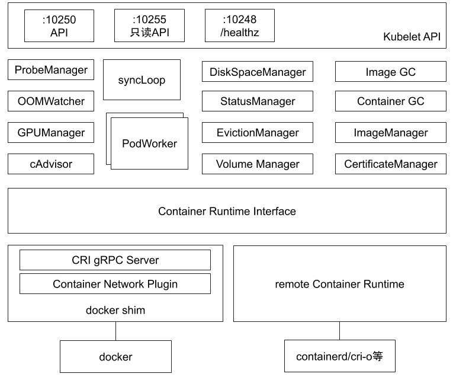

# 控制平面组件：调度器和控制器

## kube-scheduler

### 定义

负责调度Pod到Node上，监听kube-apiserver，获取还未分配Node的Pod，根据一些调度策略为这些Pod分配Node（更新Pod的nodeName）

### 调度需要考虑的因素

- 公平调度：不同优先级按照优先级排序、同优先级使用FIFO
- 资源高效利用：区分可压缩资源（CPU）和不可压缩资源（memory）
- Qos：保证服务质量
- affinity&anti-affinity：含亲和性或反亲和性的Pod
- 数据本地化（data locality）：推送作业到数据节点，避免通过网络传输数据（大数据场景）
- 内部负载干扰
- deadlines

### 调度过程

1. predicate：过滤掉不符合要求的节点

2. priority：优先级排序，选择优先级最高的节点

#### predicate策略

- PodFitsHostPorts：端口冲突检测，与主机及其他Pod不能有冲突
- PodFitsPorts：
- PodFitsResource：检查Node的资源是否充足，包括CPU、memory等
- HostName：指定NodeName时，检查候选节点中是否包含pod.Spec.NodeName
- MatchNodeSelector：检查候选节点的标签是否匹配pod.Spec.NodeSelector
- NoVolumeZoneConflict：检查volume zone是否冲突
- MatchInterPodAffinity：检查是否匹配Pod的亲和性要求
- NoDiskConflict：检查是否存在Volume冲突
- PodToleratesNodeTaints：检查Pod是否可以容忍NodeTaints
- CheckNodeMemoryPressure：检查Pod是否可以调度到有内存压力的节点上
- CheckNodeDiskPressure：检查Pod是否可以调度到有磁盘的节点上
- NoVolumeNodeConflict：检查节点是否满足Pod所引用的Volume条件

还有其他策略，可以自定义predicate策略

##### pridicate plugin工作原理


#### Priority策略

- SelectSpreadPriority：优先减少一个节点上面属于同一个Service或Replication Controller的Pod数量

- InterPodAffinityPriority：优先将Pod调度到相同的拓扑上（同一Node、Rack、Zone）

- LeastRequestedPriority：优先调度到请求资源少的节点上（批处理）

- BalanceResourceAllocation：优先平衡各节点的资源使用（long running service）

- NodeAffinityPriority：优先调度到匹配NodeAffinity的节点上

- TaintTolerationPriority：优先调度到匹配TaintToleration的节点上

- EqualPriority：将所有节点的优先级设置为1

- ImageLocalityPriority：尽量将使用大镜像的容器调度到已有该镜像的节点上

- MostRequestedPriority：尽量调度到已经使用过的Node上，适用于clusterautoscaler

调度策略可以通过Scheduler Configuration进行配置

### 资源需求

#### CPU与memory

node.status.allocatable：节点上可分配的资源

CPU：可压缩资源

当pod使用超过其设置的limits值时，pod中的进程会被限制使用cpu，但不会被kill。

内存：不可压缩资源

Kubernetes通过cgroup给pod设置QoS级别，当资源不足时先kill优先级低的pod，通过OOM分数值来实现，OOM分数值从0-1000。

pods被kill掉的顺序

best effort->burstable->guaranteed

- CPU
  
  - requests
    
    调度器调度时的参考指标，获取当前节点正在运行的pod的资源总和，再加上当前调度的pod的requests，不超过节点的allocatable即可调度
  
  - limits
    
    配置cgroup以限制资源上限
    
    cpu.shares、cpu.cfs_period_us、cpu.cfs_quota_us

- memory
  
  - requests
    
    调度器调度时的参考指标，判断节点的剩余内存是否满足pod的内存需求
  
  - limits
    
    配置cgroup以限制资源上限

##### pod的QOS class：

- guaranteed：完全占据资源，limits=requests
  
  如果一个容器只指明limits而未设定requests，则requests的值等于limits值，所以仅指定limits也可以

- burstable：申请资源较少，limits>requests
  
  pod中只要有一个容器的requests和limits的设置不相同，该pod的QoS即为burstable（如果没有明确指定也是burstable）

- best effort：对资源无要求，不设置limits和requests

##### LimitRange对象：

可以配置同一NameSpace下的缺省资源需求（默认值，限制值）

默认值在LimitRange中使用的不多，因为LimitRange与container相关，不能根据具体的container而配置，如果存在initContainers，则initContainers也会被配置默认值，但实际上并不需要

initContainers：在container启动之前启动，如果有多个，则按顺序启动

##### 相关问题：

1. 应用初始化占用较多内存，后续内存占用较少，如何设置资源限制？
   
   这种情况内存只能设置为初始化时的内存上限，这部分内存后续无法回收。纵向扩缩容暂不成熟。

2. 计算密集型作业如何锁死cpu？
   
   使用cpuset，参考[控制节点上的 CPU 管理策略 | Kubernetes](https://kubernetes.io/zh-cn/docs/tasks/administer-cluster/cpu-management-policies/)
   
   使用guaranteed pod 且配置request为整数，kubernetes会自动绑核

#### 磁盘资源需求

容器临时存储（ephemeral storage）

包含日志和可写层数据，通过pod.spec中的limits.ephemeral-storage和requests.ephemeral-storage来配置

对临时存储的限制不是基于cgroup的，而是kubelet定时获取容器的磁盘使用情况，发现使用超过限制则会驱逐pod

#### init container的资源需求

- pod包含多个init container
  
  scheduler在调度只计算cpu.request最多的init container,而不是计算所有的init container的总和，这是因为多个init container是一个数组，执行时会按照顺序执行，且执行完成后会立即退出，所以资源需求只需要最多的一个即可

- pod包含多个普通container
  
  需要计算其所有的资源需求，作为调度依据

- 计算节点已用资源
  
  对节点已用资源的计算会计算init container占用的资源，虽然init container执行结束后会退出，但是在某些情况下可能会被重启，比如更换镜像导致pod重启，此时需要保证节点的资源是足够的

### 把pod调度到指定node上

#### nodeSelector

通过spec.nodeSelector配置disktype=ssd

给node打标签：`kubectl label nodes <node-name> disktype=ssd`

删除标签：`kubectl label nodes <node-name> disktype-`

```yaml
nodeSelector:
        disktype: ssd
```

#### nodeAffinity

基于node的label来选择node 

- requiredDuringSchedulingIgnoreDuringExecution
  
  必须满足才能调度，predicate过程中使用
  
  ```yaml
  nodeAffinity:
            requiredDuringSchedulingIgnoredDuringExecution:
              nodeSelectorTerms:
                - matchExpressions:
                    - key: disktype
                      operator: In
                      values:
                        - ssd
  ```

- preferredDuringSchedulingIgnoreDuringExecution
  
  优先调度，priority过程中使用
  
  ```yaml
  preferredDuringSchedulingIgnoredDuringExecution:
            - weight: 1
              preference:
                matchExpressions:
                  - key: disktype
                    operator: In
                    values:
                      - ssd
  ```

kubectl apply和kubectl replace的区别

apply：使用patch的方式进行合并

replace：删除原有对象重现创建

#### podAffinity&podAntiAffinity

基于node上pod的label来选择node

requiredDuringSchedulingIgnoreDuringExecution、preferredDuringSchedulingIgnoreDuringExecution与nodeAffinity相同

```yaml
podAffinity:
          requiredDuringSchedulingIgnoredDuringExecution:
          - labelSelector:
              matchExpressions:
                - key: a
                  operator: In
                  values:
                    - b
            topologyKey: kubernetes.io/hostname
podAntiAffinity:
          requiredDuringSchedulingIgnoredDuringExecution:
          - labelSelector:
              matchExpressions:
                - key: app
                  operator: In
                  values:
                    - anti-nginx
            topologyKey: kubernetes.io/hostname
```

pod的范围由topologyKey限定，kubernetes.io/hostname指节点范围

#### Taints

为node添加Taints，用于保证pod不被调度到不合适的node上

目前支持的Taint类型：

- NoSchedule：新的pod不调度到该node上，不影响正在运行的pod
- preferNoSchedule：尽量不调度到该node上
- NoExecute：新的pod不调度到该node上且删除正在运行的pod，可配置tolerationSeconds

对节点添加Taint：`kubectl taint nodes cadmin for-special-user=cadmin:NoSchedule`

taint结构如下

{key}={value}:{effect}

key=for-special-user

value=cadmin

effect=NoSchedule

默认添加以下两个Taints，目的是为了自动故障转移

- node.kubernetes.io/not-ready：节点状态未就绪，依赖插件不工作等

- node.kubernetes.io/unreachable：节点失联

tolerationSeconds表示容忍时间，出现Taints后可以继续存活的时间（单位秒）

当节点出现以上的Taint，Kube-controller-manager将在tolerationSeconds之后执行evict

#### tolerations

为pod添加tolerations，使得pod可以被调度到含有Taints的node上

```yaml
tolerations:
  - key: "for-special-user"
    operator: "Equal"
    value: "cadmin"
    effect: "NoSchedule"
```

#### 多租户kubernetes集群 计算资源隔离

自带计算资源的客户要求资源隔离

实现方案：

- 将要隔离的计算节点打上Taints
- 在用户创建pod时，定义tolerations来指定要调度到的已打Taints的node

#### 优先级调度

定义PriorityClass对象

```yaml
apiVersion:V1
kin:PriorityClass
metedata:
    name:high-priority
value:1000000
globalDefault:false
```

建立pod时指定priorityClassName

```yaml
spec:
    priorityClassName: high-priority
```

在调度时，优先调度优先级高的pod，如果节点资源不足，将驱逐低优先级的pod，然后调度高优先级的pod到节点上，参考[Pod 优先级和抢占 | Kubernetes](https://kubernetes.io/zh-cn/docs/concepts/scheduling-eviction/pod-priority-preemption/)

有状态应用例如MySQL，需要使用类似[Galera](https://galeracluster.com/)的方案

当节点负载不均衡时，可以使用[descheduler](https://github.com/kubernetes-sigs/descheduler)将负载均衡到所有节点上

### 多调度器

pod的schedulerName默认是default-scheduler

如果默认调度器不满足要求，就需要部署自定义的调度器，并且一个集群中可以同时运行多个调度器实例，通过pod.spec.schedulerName来指定，不指定则使用默认调度器（default-scheduler）

## controller manager

### 控制器的工作流程


code-generater 代码生成器[kubernetes/code-generator](https://github.com/kubernetes/code-generator)

### informer的内部机制


### 控制器的协同工作原理


### 通用controller

- Job controller：处理job
  
  用于批处理任务，完成即退出
  
  parallelism: 2 并行执行数量
  
  completions: 5 执行任务数量
  
  restartPolicy：
  
  用于配置pod内的容器重启策略
  
  - job pod Never/OnFailure
    
    Never不会重启容器
    
    当 exit code!=0时，OnFailure则会重启容器
  
  - 普通pod(online service) Always
    
    默认策略当容器退出时，总是重启容器
  
  backoffLimit 表示Job的容错次数，当Job运行的Pod失败次数到达backoffLimit次时，Job Controller不再新建Pod
  
  批处理调度器，参考[volcano](https://github.com/volcano-sh/volcano)

- Pod AutoScaler：处理pod的自动扩缩容
  
  HorizontalPodAutoscaler
  
  HPA/VPA

- ReplicaSet：根据replica 创建pod

- Service Controller：为LoadBalancer的service创建LB VIP

- Service Account Controller：确保Service Account在当前namespace存在

- StatefulSet Controller：处理StatefulSet中的pod
  
  - updateStrategy
    
    patition:0，升级时升级index=0的pod
  
  - service 暴露服务
  
  - PVC 外挂存储

- Namespace Controller：删除namespace时，删除该namespace下的所有资源

- Node Controller：维护node状态，处理evict请求等

- Daemon Controller：根据daemonSet创建pod，daemonSet是每个节点需要运行的 
  
  daemonSet与deployment的区别
  
  - deployment通过replicaSet简介实现版本控制
  
  - daemonSet使用统一的controllerrevision
  
  StatefulSet daemonSet 升级版本信息 controllerrevision

- Garbage Collecter：处理级联删除，构建对象间关系（通过ownerReference），例如删除deployment时删除replicaset及pod
  
  `kubectl delete {resource} {resource-name} --cascade=orphan`

### Cloud Controller Manager

与企业cloud做深度集成，通常包括：

- 认证授权
- 高可用

### scheduler和controller的高可用

- endpoint
  
  将leader信息annotate到endpoint上，包括leader名称、释放周期、获取时间、刷新时间、任期

- lease
  
  独立对象，专门用于leader election
  
  watch->renew->update


## kubelet

### 架构



### kubelet管理pod的核心流程


#### pod update

1. updatePodOptions 

2. syncPod（get pod status fro pod cache）

3. computePodActions

4. create/kill(container runtime) 

#### PLEG relist

- provide pod info to syncPod

- report pod lifecycle events

#### kubelet服务进程

- 接受并执行master指令

- 管理Pod及容器

- 通过cAdvisor监控节点和容器的资源并定期向master上报

#### sandbox container

稳定运行，几乎不消耗资源，是其他业务容器的底座，在创建pod时加载网络配置

#### Pod启动流程


Kubelet启动Pod的流程


### CRI

#### 容器运行时接口

Container Runtime，运行于kubernetes中的每个节点中，负责容器的整个生命周期。而CRI（Container Runtime Interface）容器运行时接口以支持更多的容器运行时

CRI是一组gRPC服务，定义kubelet（客户端）与container runtime（服务端）的通信

- 镜像服务（Image Service）
  
  提供镜像下载、检查及删除的远程调用

- 运行时服务（Runtime Service）
  
  管理容器生命周期和与容器交互的远程调用


#### 运行时的层级

- 高层级运行时
  
  Dockershim、containerd、CRI-O
  
  下载OCI镜像，并解压为OCI运行时文件

- 低层级运行时
  
  runC、kata-runtime
  
  从OCI运行时文件运行容器，并定义配置、运行环境、生命周期、namespace、cgroup、rootFS

#### CRI的组成


#### 不同运行时的比较


### CNI

容器网络接口

#### kubernetes网络模型设计原则

- 所有Pod能顾不通过NAT就可以相互访问
- 所有节点能够不通过NAT就可以相互访问
- 容器内看见的IP地址和外部组件看到的容器IP是一样的

kubernetes的IP地址是以Pod的单位进行分配的，每个Pod拥有独立的IP地址

#### CNI常用插件分类

- IPAM：IP地址分配

- 主插件：网卡设置
  
  - bridge：创建网桥
  - ipvlan：添加ipvlan网口
  - loopback：添加loopback网口

- 附加功能：Meta
  
  - portmap：设置主机与容器的端口映射
  - bandwidth：利用Linux Traffic Control限流
  - firewall：利用iptables或firewalld为容器设置防火墙规则

#### 容器运行时CNI参数

- cni-bin-dir：网络插件的可执行文件所在目录，默认是/opt/cni/bin

- cni-conf-dir：网络插件的配置文件所在目录，默认是/etc/cni/net.d

#### Flannel

有CoreOS开发的早期入门级CNI插件

- 使用kubernetes的etcd存储状态信息
- 主机内的Pod使用网桥
- 主机间的Pod使用flanneld将流量封装在UDP数据包中进行路由
- 封装方式默认为VxLAN，性能良好，但流量追踪困难

#### Calico

性能、灵活性、网络策略

- 主机内部：BGP路由，无需额外封装
- 主机间：IPinIP
- 网络策略：使用ACLs和kube-proxy创建iptables

### CSI

#### 容器运行时存储

- Device Mapper
- OverlayFS（默认）

#### 存储卷插件

- in-tree插件
- out-of-tree FlexVolume插件
- out-of-tree CSI插件

out-of-tree CSI插件是现在的主流模式

CSI通过RPC预存储驱动进行交互，kubernetes对CSI存储驱动的要求主要有以下两个：

- kube-controller-manager
  
  用于感知CSI驱动的存在

- kubelet
  
  用于与CSI驱动进行交互

#### CSI驱动

CSI驱动一般包含attacher、provisioner、resizer、snapshotter、node-driver-register、CSI driver等模块


#### 临时存储

emptyDir

主要使用场景是给应用充当缓存空间，或存储中间数据用于快速恢复，一般存储在当前节点上所使用的的存储介质上，可以是网络存储或本地存储

emptyDir与Pod的生命周期相关联，当Pod被删除时，emptyDir中的数据也会被删除，但Pod重启不会导致数据丢失。

#### 半持久化存储

hostPath

主要应用场景是挂载在某些需要获取节点信息的Pod上，这是因为hostPath能够将主机节点的文件或目录挂载到指定Pod上，例如，某个Pod需要获取节点上所有Pod的log，可以通过hostPath访问所有Pod的stdout目录

由于Pod可能会被调度到不同节点，导致hostPash的内容发生变化，但是在之前节点上写入hostPath的数据将不会被删除，会占用磁盘空间

#### 持久化存储

- StorageClass
  
  标识存储的类型，主要包含存储插件的provisioner、卷的创建和mount参数

- Volume
  
  对存储系统的抽象，容器中的文件是不稳定的，可能会因为崩溃而丢失数据，同时多个容器间可能需要数据共享

- PV（Persistent Volume）
  
  代表系统后端真实的存储空间，由集群管理员提前创建，或根据PVC的申请动态地创建

- PVC（Persistent Volume Claim）
  
  代表用户对存储需求的声明，一般由用户创建，包含需要的存储大小、存储卷的访问模式及Storage Class，其中存储卷的访问模式必须与存储的类型一致
  
  - ReadWriteOnce
    
    卷仅能在一个节点上被mount，属性为可读可写
  
  - ReadOnlyMany
    
    卷可以在不同的节点上被mount，属性为只读
  
  - ReadWriteMany
    
    卷可以在不同的节点上呗mount，属性为可读可写

存储对象关系


#### 独占的Local Volume

挂载流程


#### Dynamic Local Volume

CSI驱动汇报节点存储相关的资源信息，用于调度

挂载流程


#### Rook

开源的分布式存储编排系统，支持Ceph、NFS等存储系统

自动管理、自动扩容、自动修复

Rook架构


##### Rook Operator

Rook的核心 组件，以deployment形式存在，实现了CRD，接受kubernetes创建资源的请求并创建相关资源，监控存储守护进程，确保存储集群的健康

##### Rook Discover

以DaemonSet的形式部署在所有的存储节点上，主要作用是检测存储节点上的存储设备，并记录符合要求的设备信息

##### Rook Agent

以DaemonSet的形式部署在所有的存储节点上，主要作用是处理存储操作，例如挂载卸载存储卷及格式化文件系统
