# 生命周期管理与服务发现

## 深入理解Pod的生命周期

### Pod的生命周期

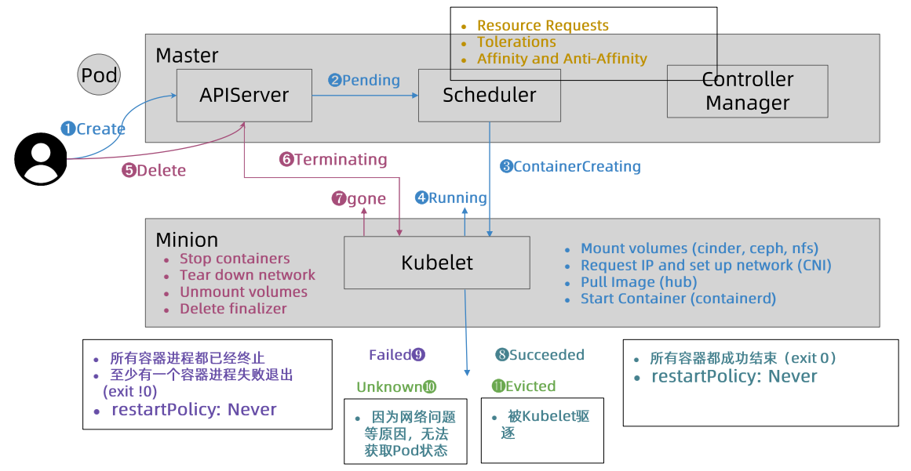

#### Pod状态机

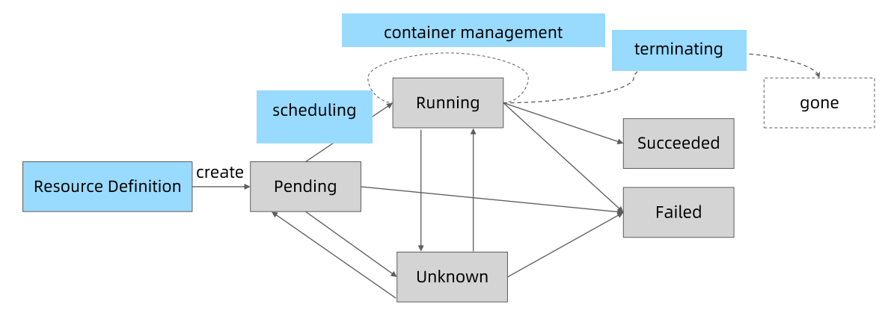

#### Pod Phase

- Pending
- Running
- Succeeded
- Failed
- Unknown

kubectl get pod显示的status是根据pod status中的conditions和phase计算出来的

pod状态计算细节

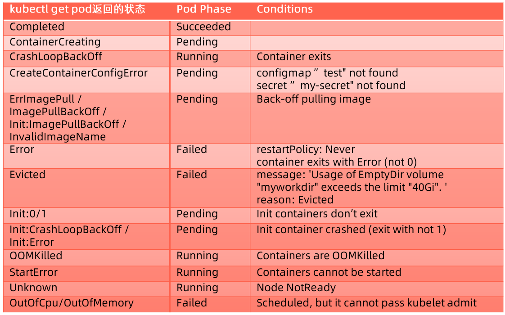

查看Pod细节：```kubectl get pod <podname> -oyaml```

查看Pod相关事件：```kubectl describe pod <podname>```

#### Pod的高可用

避免容器进程被终止、避免Pod被驱逐

- 设置合理的resource.memory limits，防止容器进程被OOM kill
- 设置合理的emptyDir.sizeLimit，确保数据写入不超过emptyDir的限制，防止Pod被驱逐

##### Pod的QoS class

1. Guaranteed
   
   - Pod中每个容器都设置了CPU和内存的资源
   - Pod中每个容器CPU和内存的limits和requests的值完全一致
   
   这一类型的主要作用是保护重要的Pod

2. Burstable
   
   - Pod中至少一个容器设置了CPU或内存的requests
   
   这一类型适合大多数场景，需要合理设置limits和requests，有利于提高集群资源利用率并减少Pod被驱逐的概率

3. BestEffort
   
   - Pod中没有容器设置内存和 CPU 的limits和requests
   
   这一类型应该在测试环境使用，可以确保大多数应用不会因为资源问题处于pending状态，只要有可用的节点，就可以将Pod调度上去

当计算节点检测到内存压力时，kubernetes会按照BestEffort、Burstable、Guaranteed的顺序驱逐Pod

这里的驱逐与Pod的优先级也有关系，具体可参考官方文档[节点压力驱逐](https://kubernetes.io/zh/docs/concepts/scheduling-eviction/node-pressure-eviction/#pod-selection-for-kubelet-eviction)

##### 基于Taints的Evictions

kubernetes会自动为Pod增加not-raedy和unreachable的tolerations

可以通过增加not-ready或unreachable的toleration Seconds，避免因为短时间的节点状态不正常而被驱逐

##### 健康检查探针

类型：

- livenessProbe：存活状态检查
  
  默认状态为Success，失败意味着容器运行状态不正常，kubelet 会杀死容器，并需要根据restartPolicy对容器执行操作

- readinessProbe：就绪状态检查
  
  默认状态为Failure，失败意味着应用已无法正常提供服务，kubelet会将该容器从服务列表中删除

- startupProbe：初始化阶段的健康检查
  
  指示容器中的应用是否已经启动。如果提供了启动探针，则所有其他探针都会被 禁用，直到此探针成功为止。如果启动探测失败，kubelet将杀死容器，而容器依其restartPolicy对容器执行操作

探测方法：

- ExecAction
  
  在容器内部运行指定命令，返回码为0表示探测成功

- TCPSocketAction
  
  kubelet通过TCP协议检查容器IP和端口，端口可达即为探测成功

- HTTPGetAction
  
  kubelet对Pod的IP和指定端口发起HTTP GET请求，返回码在200-400之间表示探测成功

探针属性：

- initialDelaySeconds：初始执行延迟时间

- periodSeconds：检查间隔时间

- timeoutSeconds：执行超时时间

- successThreshold：连续成功次数

- failureThreshold：连续出错次数

readinessGates

可扩展的就绪条件（conditions）

新引入的readinessGates condition需要状态为True后，Pod才可以为就绪状态，此状态应该由控制器修改

##### Post-start与Pre-stop

Post-start

在启动容器时执行Post-start脚本，容器的Entrypoint与Post-Start脚本没有绝对的先后顺序，无法保证哪一个先执行

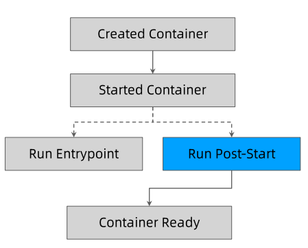

Pre-stop

首先执行Pre-Stop脚本，此时grace period开始计时，执行完成后，将发生SIGTERM信号给容器，如果容器进程响应SIGTERM，则容器可以优雅停止，如果到了grace period达到预定时间，容器还没有停止，将发送SIGKILL信号，强行终止容器。

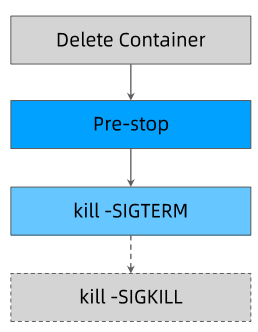

如果Pre-Stop脚本或者对于SIGTERM信号的处理时间较长，为了保证处理过程正常结束，需要手动延长terminationGracePeriodSeconds

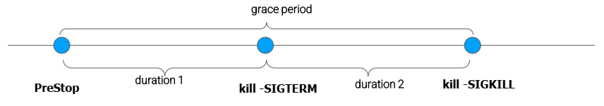

注意：由于bash/sh会忽略SIGTERM信号，所以SIGTERM会永远超时，如果应用使用bash/sh作为Entrypoint，应避免使用过长的grace period

terminationGracePeriodSeconds的默认时长为30秒，如果不关心终止时长，则不需要特殊处理

如果需要优雅终止，可以选择在Pre-Stop脚本中主动退出进程，还可以在容器中使用特定的初始化进程，通过响应SIGTERM信号的方式优雅终止

一个优雅的初始化进程[tini](https://github.com/krallin/tini)

- 正确处理系统信号，将信号转发给子进程
- 在主进程退出前，确保所有子进程退出
- 监控并清理孤儿进程

### 在kubernetes上部署应用的挑战

#### 资源规划

- 计算资源
  - CPU/GPU
  - memory
- 存储资源
  - 容量大小
  - 存储位置：本地或网盘
  - IO性能
- 网络资源
  - QPS和带宽

#### 存储的挑战

多容器共享存储最简单的是emptyDir

- 对emptyDir设置size limit
- 达到size limit后，容器将会被驱逐，原Pod的配置信息会丢失

#### 应用配置

传入方式：

- Environment Variables
- Volume Mount

数据来源：

- ConfigMap
- Secret
- Download API

数据存储

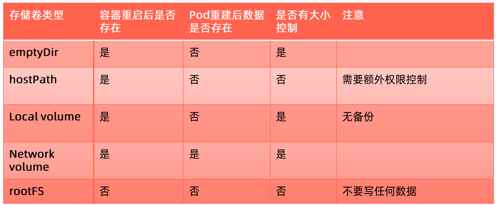

- emptyDir
  
  Pod重启后数据会丢失

- hostPath
  
  需要额外权限控制

- Local Volume
  
  需要额外备份机制

- Network Volume
  
  速度与稳定性问题

- rootFS
  
  不建议写任何数据

#### 容器应用可能面临的进程中断

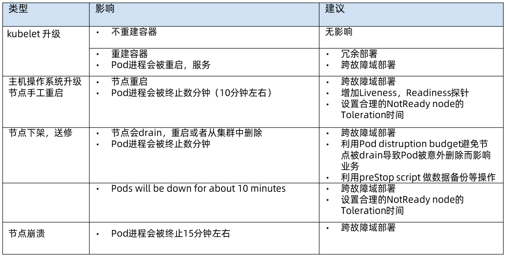

- kubelet升级
  
  容器重建：冗余部署，跨故障域部署

- 节点操作系统升级
  
  Pod进程被终止：跨故障域部署，增加Liveness、Readiness探针

- 节点下架、送修
  
  节点被排空，从集群中删除：跨故障域部署，配置PoddisruptionBudget控制失效情况，利用Pre-Stop脚本做数据备份

- 节点崩溃
  
  跨故障域部署

#### 高可用部署方式

- 多实例跨故障域部署
- 合理的更新策略：
  - maxSurge：先创建新版本的Pod，再删除旧版本的Pod
  - maxUnavailable：有Pod状态异常时，暂停更新

## 服务发现

### 服务发布

不同的服务发布类型

- ClusterIP（Headless）

- NodePort

- LoadBalancer

- ExternalName

服务发布的挑战

kube-dbs

- DNS TTL问题

Service

- ClusterIP只能对内

- kube-proxy支持的iptables/ipvs支持的规模有限

- ipvs的性能和生产化问题

- kube-proxy的drift问题

- 频繁的pod变动导致LB频繁变更

- 对外发布的Service需要与企业LB集成

- 不支持gRPC

- 不支持自定义DNS和高级路由功能

Ingress

- Spec的成熟度不足

跨地域部署

- 需要多少实例

- 失败域控制

- 精细的流量控制

- 按地域的顺序更新

- 发布与回滚

## 微服务架构下的高可用

### 服务发现

#### 微服务架构

由一系列职责单一的细粒度服务构成的**分布式**网状架构，服务之间需要轻量级通讯，必须引入一个**服务发现机制**，服务的提供方需要注册服务地址，服务的调用方需要发现目标服务，服务提供方一般以集群方式提供服务，需要保证**负载均衡**及**健康检查**。

#### 集中式LB服务发现

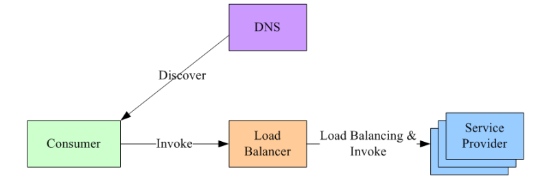

运行机制

- 服务消费方和服务提供方之间有一独立LB

- LB存储所有服务的地址映射表

- 服务调用时，服务消费方向LB发起请求，LB以某种策略进行负载均衡，选择服务提供方并转发请求

- LB需要健康检查能力，自动去除异常服务实例

- 服务消费方通过DNS发现LB

特点

- 实现方案简单，LB容易实现集中式的访问控制

- 单点问题，所有服务调用流量都经过LB，服务数量多或调用量大时容易成为瓶颈；如LB发生故障，则影响整体可用性

- LB在服务消费方和服务提供方之间增加了一跳，存在一定性能开销

#### 进程内LB服务发现

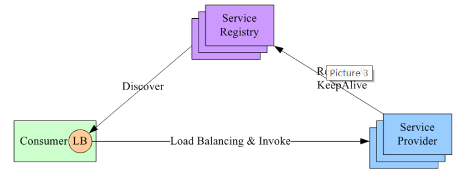

运行机制

- 将LB以库的方式集成到服务消费方进程内，也称为客户端负载方案

- 服务提供方在服务启动时将服务地址注册到服务注册表，并维持心跳以维持存活状态

- 服务消费方调用服务时，通过内置的LB向服务注册表查询（同时缓存并定时刷新）目标服务的地址列表，然后以某种策略进行负载均衡，选择一个目标服务地址并发起请求

- 服务注册表需要满足较高的可用性与一致性（zk、consul、etcd）

特点

- 分布式方案，无单点问题

- 性能较好，没有额外的网络跳转

- 与业务进程语言相关，有额外的研发与维护成本

- 与业务进程耦合，发布升级有一定影响

#### 独立LB进程服务发现

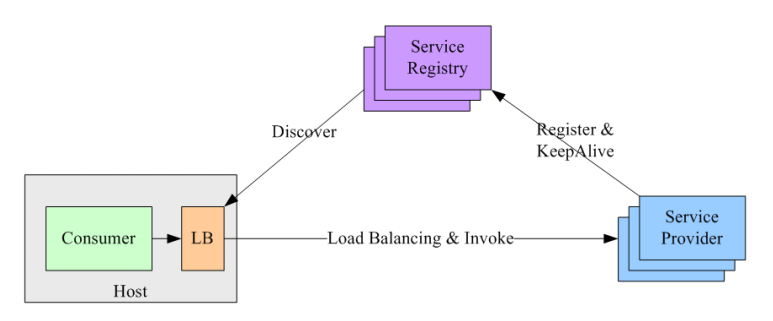

运行机制

- 针对进程内LB不足的优化方案

- 将LB和服务发现功能从服务调用方进程内移出，成为主机上的独立进程，负责该主机上所有服务的负载均衡与服务发现

- LB进程可以进一步解耦，以集群方式提供高可用的服务

特点

- 分布式方案，无单点问题

- 服务调用方和LB之间是进程间调用，性能较好

- 服务调用方和LB解耦，无依赖关系

- 部署较复杂、调试排错不便

### 负载均衡

分类

- 纵向（垂直）扩展
  
  增加单机硬件处理能力，如CPU、内存、硬盘等，无法满足大型分布式系统中大流量、高并发、海量数据的问题

- 横向（水平）扩展
  
  通过增加机器数量来提升处理能力，利用负载均衡技术，将压力分散在多台机器上

作用

- 解决并发压力，提升处理性能，增加吞吐量

- 提供故障转移机制，实现高可用

- 可调整机器数量，提供伸缩性和扩展性

- 安全防护，负载均衡器上配置黑白名单等

#### DNS负载均衡

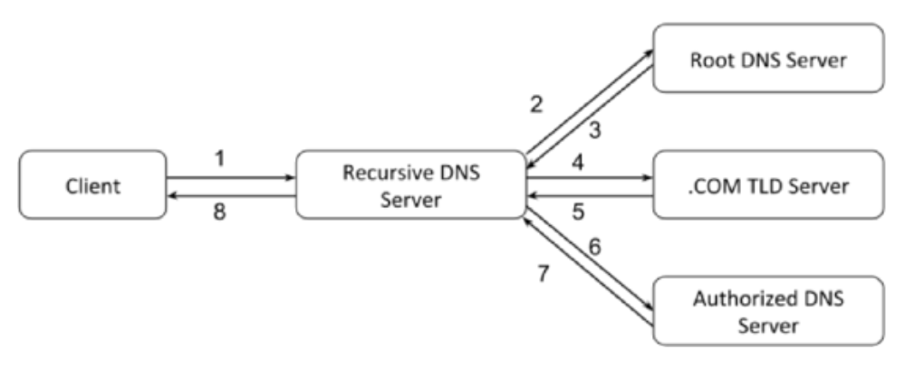

在DNS服务器中，配置多个A记录，这些A记录对应的服务器构成集群

优点

- 使用简单，不需要额外的LB

- 性能较好，可以支持基于位置的域名解析，可以将域名解析为距离用户最近的服务器地址，加快用户访问

缺点

- 可用性差，修改DNS后，解析时间较长，解析过程中访问将失败

- 扩展性低，DNS的控制权在域名服务商，无法扩展

- 维护性差，无法反映服务器的运行状态，无法区分服务器的差异，支持的负载均衡算法少

#### 负载均衡技术

##### 网络地址转换

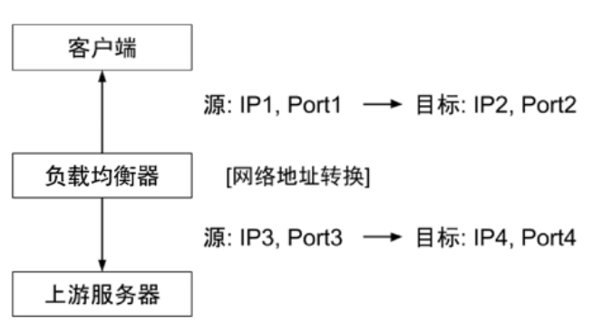

通常通过修改包的源地址或目标地址来控制包的转发行为

##### 新建TCP连接

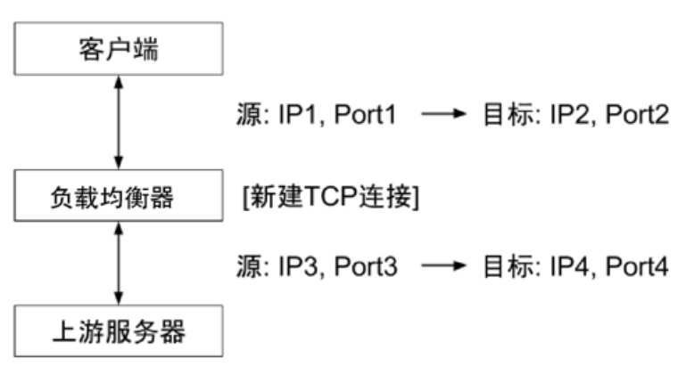

负载均衡器负责记录源地址

##### 链路层负载均衡

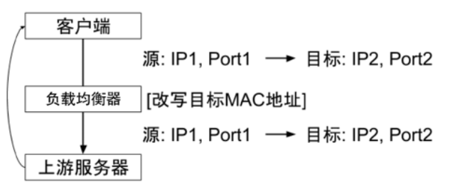

不修改IP地址，只修改MAC地址，配置真实物理服务器的虚拟IP与负载均衡服务器的IP一致，返回时直接返回给客户端，不需要经过负载均衡服务器进行转发，称为直接路由模式（DR）

##### 隧道技术

IP over IP，保持原有的数据包IP不变，在IP头外层添加额外的IP包头，收到数据包时，解开外层的IP包头，得到原始数据包，这种方式也可以直接返回给客户端

## Service

## kube-proxy

- userspace
  
  用户空间监听端口

- iptables

- ipvs

- winuserspace

出节点流量转换 通过iptables的IPset